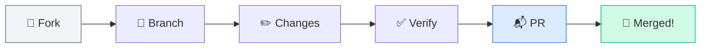

# Contributing to Access to Housing

Thank you for your interest in contributing! This project is part of [CoTrackPro's](https://github.com/CoTrackPro) open-source Access Projects initiative.



## Ways to Contribute

### 1. Suggest or Add Data Sources
Housing intelligence is only as good as its data. If you know of a reliable, publicly accessible data source that isn't in our [`assets/data-sources.md`](assets/data-sources.md), please submit a PR or [open an issue](https://github.com/dougdevitre/access-to-housing/issues/new?template=data-source.yml).

**Include**: Source name, URL, update frequency, geographic coverage, and which module(s) it supports.

### 2. Expand Module Coverage
Each of our 7 core modules and 7 reference pods (80 total modules) can be extended with region-specific frameworks, additional scoring rubrics, or new analytical approaches. We welcome:
- International market adaptations
- State/local regulatory context additions
- New scoring dimensions with clear methodology documentation
- Community Trust module expansions (civic data, local government transparency, resource directories)

### 3. Community Trust Contributions
The **Community Trust & Transparency Pod** is especially open to community-driven contributions:

| Contribution Type | Examples |
|------------------|---------|
| **Local data sources** | Municipal 311 portals, code enforcement databases, planning commission archives |
| **Resource directories** | HUD-approved counselors, legal aid orgs, tenant advocacy groups in your area |
| **Civic engagement info** | Public meeting schedules, FOIA procedures, advisory board application processes |
| **Displacement indicators** | Local eviction data, rent burden statistics, affordable housing inventories |

These contributions directly serve the communities the platform is designed to help.

### 4. Fair Housing Review
We take Fair Housing compliance seriously. If you identify any module, template, or framework that could inadvertently produce analysis based on protected class characteristics (or proxies), please flag it immediately via [issue](https://github.com/dougdevitre/access-to-housing/issues/new?template=fair-housing-concern.yml) or email.

### 5. Accessibility & Plain Language
Many users of this project are not professional analysts. Contributions that improve plain-language explanations, add glossaries, or simplify output templates are valuable.

### 6. Reference Pod Expansion
The `references/` directory contains 7 analytical pods with 80 total modules. Each pod can be expanded with additional frameworks, case studies, or methodology documentation.

| Pod | Modules | Expansion Opportunities |
|-----|:-------:|------------------------|
| Market Intelligence | 16 | Regional pricing models, local MLS integration guides |
| Investment & Deal | 16 | International underwriting frameworks, emerging market models |
| Risk & Climate | 6 | State-specific insurance data, local resilience plans |
| Property Intelligence | 10 | Regional valuation models, local rental market guides |
| Brokerage Ops | 18 | CRM integration templates, local marketing strategies |
| Brokerage Strategy | 10 | Regional recruiting guides, market-specific KPIs |
| Community Trust | 6 | Local civic data, resource directories, engagement guides |

## Contribution Process

1. **Fork** this repository
2. **Create a branch** (`feature/your-module-name` or `fix/description`)
3. **Make your changes** — follow existing formatting patterns
4. **Verify Fair Housing compliance** — run through the checklist in [`FAIR-HOUSING.md`](FAIR-HOUSING.md)
5. **Submit a PR** with a clear description of what you added/changed and why
6. **Review** — we'll provide feedback within a week

## Style Guidelines

- Use Markdown for all documentation
- Follow existing output template structures (Signal Summary → Key Findings → Detailed Analysis → Data Caveats → Next Steps)
- Always cite data sources with name and vintage
- Never include analysis based on protected class characteristics
- Use mermaid diagrams (flowchart or pie type only) for visual workflows — these render natively on GitHub
- Keep tone professional, analytical, and accessible

## Fair Housing Compliance Checklist

Before submitting any contribution, verify:

- [ ] No analysis based on race, color, national origin, religion, sex, familial status, or disability
- [ ] No proxy metrics that effectively score on protected characteristics
- [ ] School quality scored only on proximity and access
- [ ] Crime data expressed as density-normalized rates, not raw counts
- [ ] Neighborhood comparisons use objective infrastructure metrics only
- [ ] Community data (311, code enforcement) normalized per housing unit, not per area

## Code of Conduct

Be kind, be constructive, be collaborative. This project exists to make housing intelligence more accessible — contributions should reflect that mission.

## For Developers

If you're building applications that integrate with Access to Housing, these resources are for you:

| Resource | Path | What It Contains |
|----------|------|------------------|
| **Output Schemas** | [`assets/output-schemas.md`](assets/output-schemas.md) | JSON Schema definitions for all scoring modules — Livability, Opportunity Scanner, Displacement, Accountability, Conditions, Platform Brief |
| **API Reference** | [`assets/api-reference.md`](assets/api-reference.md) | 85+ data sources organized by auth type (free/key/paid), with endpoints, rate limits, and integration patterns |
| **Glossary** | [`assets/glossary.md`](assets/glossary.md) | 40+ term definitions for building user-facing interfaces |
| **CLAUDE.md** | [`CLAUDE.md`](CLAUDE.md) | Repo context for developers using Claude Code — architecture decisions, file relationships, sync points |

### Developer Contribution Areas

| Area | Examples |
|------|---------|
| **Output schemas** | Add schemas for modules that don't have them yet, improve validation rules |
| **API integrations** | Document new API endpoints, write example queries, test rate limits |
| **Data pipelines** | Build scripts to fetch and normalize data from free sources (Census, FEMA, Walk Score) |
| **Validation tools** | Create Fair Housing compliance linters that check outputs against schema rules |
| **Visualization** | Build dashboards or maps that consume module outputs using the JSON schemas |

### Integration Quick Start

```
1. Review output schemas     → assets/output-schemas.md
2. Pick your data stack      → assets/api-reference.md (see Integration Patterns)
3. Understand compliance     → FAIR-HOUSING.md
4. Build and validate        → Use JSON schemas for output validation
5. Cite sources with vintage → Every data point needs source + date
```

## Questions?

- Open a [discussion](https://github.com/dougdevitre/access-to-housing/discussions) or [issue](https://github.com/dougdevitre/access-to-housing/issues)
- Email: [dougdevitre@gmail.com](mailto:dougdevitre@gmail.com)
