<div align="center">

# 🏠 Access to Housing

### PropTech Intelligence Platform

**Market analysis, climate risk scoring, and Fair Housing-safe tooling for everyone.**

[](LICENSE)
[](#-fair-housing-compliance)
[](#-reference-pods--80-modules)
[](https://github.com/CoTrackPro)
[](https://dougdevitre.github.io/access-to-housing/)

<br>

**7 Core Modules** · **7 Reference Pods** · **85+ Data Sources** · **Zero Protected-Class Proxies**

<br>

```
"Housing intelligence should be accessible to everyone
 — not just those who can afford enterprise subscriptions."
```

</div>

---

## Table of Contents

- [The Problem](#the-problem)
- [How It Works](#-how-it-works)
- [Core Modules](#-core-modules)
- [Reference Pods](#-reference-pods--80-modules)
- [Quick Start](#-quick-start)
- [Platform Architecture](#-platform-architecture)
- [Key Workflows](#-key-workflows)
- [Scoring Frameworks](#-scoring-frameworks)
- [Data Sources](#-data-sources)
- [Fair Housing Compliance](#-fair-housing-compliance)
- [Repository Structure](#-repository-structure)
- [FAQ](#-faq)
- [CoTrackPro Ecosystem](#-cotrackpro-access-projects)
- [Contributing](#-contributing)
- [License & Contact](#-license--contact)

---

## The Problem

Housing decisions are some of the highest-stakes financial choices people make, yet the data that drives them is **fragmented across dozens of systems** — MLS, tax records, climate models, permit databases, and demographic forecasts.

```mermaid
flowchart LR
    subgraph FRAGMENTED ["❌ TODAY: Fragmented Data"]
        direction TB
        A1["MLS Listings"]
        A2["Tax Records"]
        A3["Climate Models"]
        A4["Permit Databases"]
        A5["Demographic Forecasts"]
        A6["Zoning Codes"]
    end

    subgraph UNIFIED ["✅ ACCESS TO HOUSING: Unified Intelligence"]
        direction TB
        B1["📊 Structured Analysis"]
        B2["⚖️ Fair Housing Safe"]
        B3["📍 Cited Sources"]
    end

    FRAGMENTED -->|"7 Core Modules\n7 Reference Pods"| UNIFIED

    style FRAGMENTED fill:#fef2f2,stroke:#ef4444
    style UNIFIED fill:#ecfdf5,stroke:#10b981
```

Real estate professionals, first-time homebuyers, housing advocates, and community planners need intelligence tools that are:

- **Comprehensive** — not siloed by data type
- **Compliant** — safe under Fair Housing law
- **Accessible** — no enterprise budget required

---

## 🔄 How It Works

Access to Housing is a [Claude Custom Skill](https://docs.claude.com) that acts as your PropTech intelligence analyst. Ask a question, and the platform matches it to the right analytical framework, pulls from authoritative data sources, and delivers cited, structured analysis.


**Every output includes**: signal summary, key findings with evidence, methodology transparency, data caveats, and actionable next steps.

### Who It's For

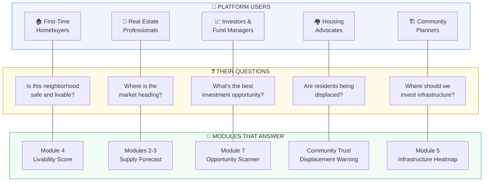

---

## 🧩 Core Modules

<table>
<tr>
<td width="50%">

### Detection & Supply

| # | Module | Lead Time |
|:-:|--------|:---------:|
| 1 | **Satellite Housing Detection** | Pre-permit |
| 2 | **Construction Permit Intelligence** | 6–24 months |
| 3 | **Global Housing Supply Forecast** | 12–36 months |

</td>
<td width="50%">

### Scoring & Opportunity

| # | Module | Scope |
|:-:|--------|:-----:|
| 4 | **Neighborhood Livability Score** | Local |
| 5 | **Infrastructure Growth Heatmap** | Regional |
| 6 | **Climate Migration Model** | National |
| 7 | **Global Opportunity Scanner** | Global |

</td>
</tr>
</table>

### How Modules Connect

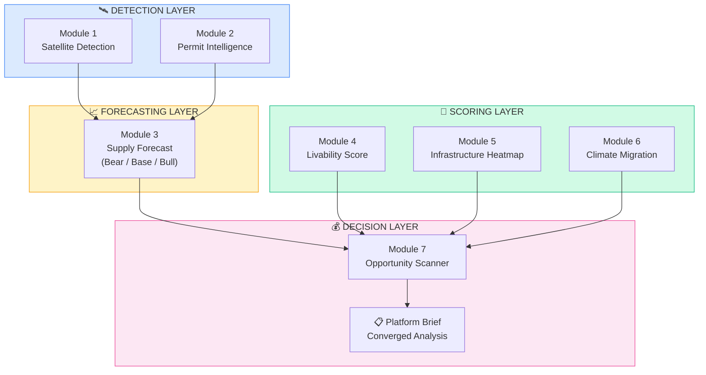

> Modules feed upward — detection informs forecasts, scoring informs opportunity ranking, and everything converges in the **Platform Brief**.

### Module Scope: Local to Global

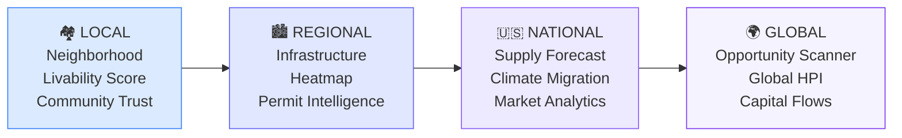

---

## 📚 Reference Pods — 80 Modules

Seven specialized pods extend the core modules with deep analytical frameworks:

| Pod | Modules | Key Frameworks |
|-----|:-------:|----------------|
| **Market Intelligence** | 16 | Pricing trends, absorption rates, inventory analysis, demographic forecasting, housing cycles, affordability indices, migration tracking |
| **Investment & Deal** | 16 | Opportunity scanning, underwriting, portfolio analysis, capital flows, development feasibility, MLS analytics, syndication |
| **Risk & Climate** | 6 | Flood/fire/heat/hurricane risk scoring, insurance market health, construction risk, zoning compliance, tenant screening |
| **Property Intelligence** | 10 | AVM, valuation modeling, neighborhood scoring, infrastructure heatmaps, pricing strategy, listing performance, rental intelligence |
| **Brokerage Ops** | 18 | CRM health, lead generation, pipeline management, buyer/seller workflows, transaction management, marketing, client experience |
| **Brokerage Strategy** | 10 | Brokerage growth modeling, recruiting, financial modeling, strategic planning, KPI reporting, agent development pathways |
| **Community Trust** | 6 | Civic transparency tracking, community-reported conditions, displacement early warning, government accountability, neighborhood resources, engagement guide |

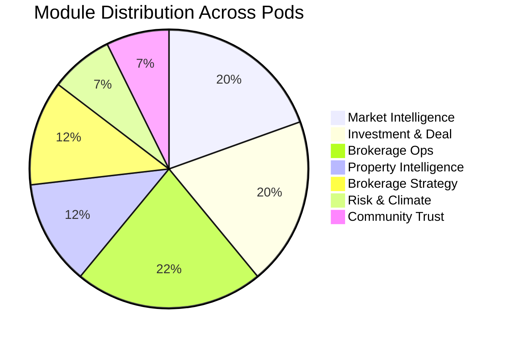

---

## 🚀 Quick Start

### Option 1: Claude Custom Skill

```
1. Download the .skill file from Releases
2. Claude.ai → Settings → Custom Skills → Upload
3. Start asking questions
```

**Try these prompts:**

| Prompt | Module Triggered |
|--------|:----------------:|
| *"Run a neighborhood livability score for Clayton, MO"* | Module 4 |
| *"What's the permit pipeline in north St. Louis County?"* | Module 2 |
| *"Score Denver vs. Nashville as investment markets"* | Module 7 |
| *"Climate migration risk assessment for coastal Florida"* | Module 6 |
| *"Where is infrastructure spending signaling future growth?"* | Module 5 |
| *"12-month housing supply forecast for Austin, TX"* | Module 3 |
| *"What zoning decisions has the city council made this year?"* | Community Trust Pod |
| *"Displacement risk assessment for East Nashville"* | Community Trust Pod |
| *"How responsive is code enforcement in my city?"* | Community Trust Pod |

### Option 2: Documentation Site

Browse the full platform documentation at **[dougdevitre.github.io/access-to-housing](https://dougdevitre.github.io/access-to-housing/)** — searchable, mobile-friendly, with navigable reference pods and resource pages.

### Option 3: Reference Library

Browse the [`references/`](references/) directory directly — each pod contains scoring rubrics, data source recommendations, output templates, and methodology notes you can use independently.

---

## 🛠️ For Developers

Building on top of Access to Housing? These resources are designed for integration and automation.

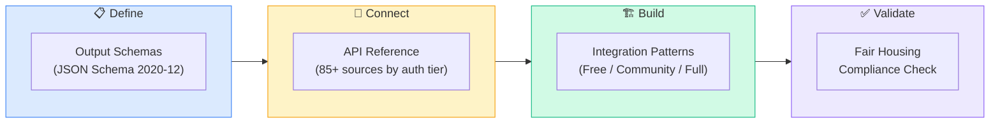

| Resource | Path | What It Contains |
|----------|------|------------------|
| **Output Schemas** | [`assets/output-schemas.md`](assets/output-schemas.md) | JSON Schema definitions for Livability, Opportunity Scanner, Displacement, Accountability, Conditions, Platform Brief |
| **API Reference** | [`assets/api-reference.md`](assets/api-reference.md) | 85+ sources organized by auth type — endpoints, rate limits, 3 integration patterns |
| **Glossary** | [`assets/glossary.md`](assets/glossary.md) | 40+ term definitions for building user-facing interfaces |
| **Example Prompts** | [`assets/example-prompts.md`](assets/example-prompts.md) | Test cases for every module — input prompts with expected output structure |
| **CLAUDE.md** | [`CLAUDE.md`](CLAUDE.md) | Repo context for Claude Code — architecture decisions, file sync points, conventions |

---

## 🏗️ Platform Architecture

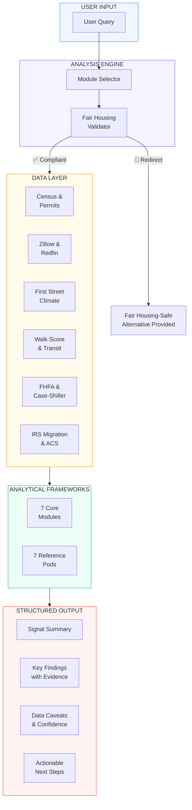

---

## 🔀 Key Workflows

### Investment Decision Workflow

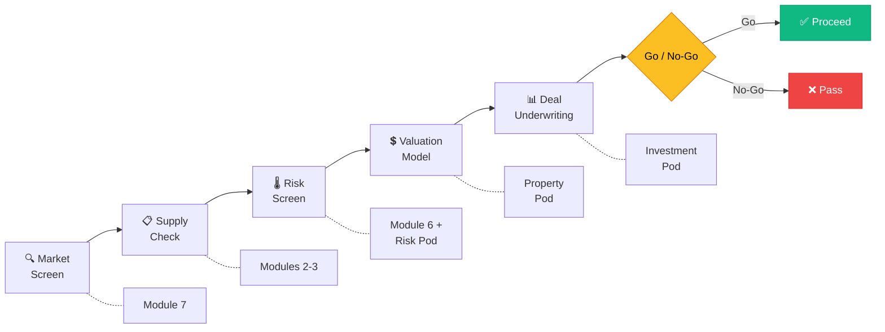

### Homebuyer Neighborhood Selection

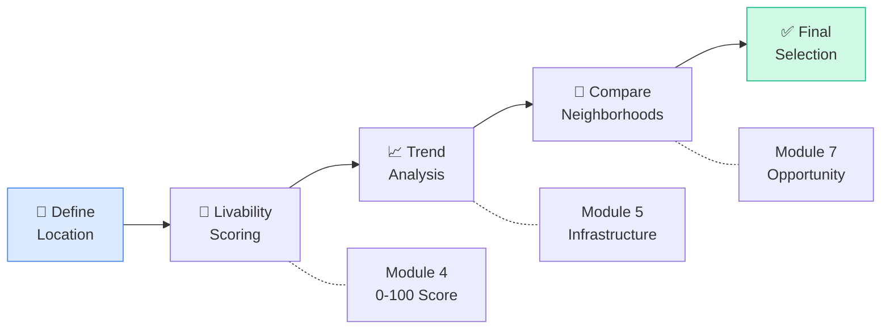

### Climate Risk Assessment

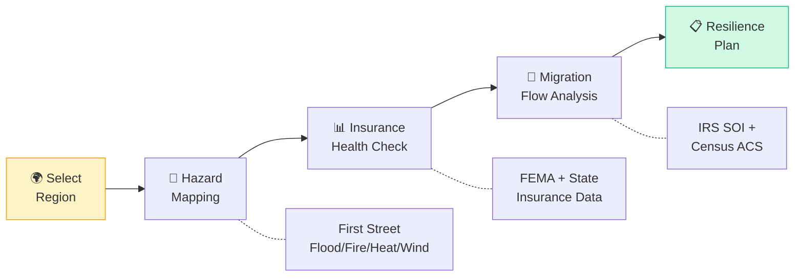

### Community Trust Assessment

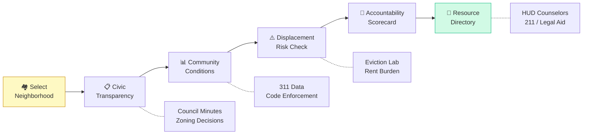

---

## 📐 Scoring Frameworks

### Neighborhood Livability Score (Module 4)

```
                         LIVABILITY SCORE: 0-100
    ┌─────────────────┬─────────────────┬─────────────────┬─────────────────┐
    │  🚇 TRANSIT     │  🌳 PARKS &     │  🛡️ SAFETY     │  🎓 EDUCATION  │
    │  ACCESS         │  AMENITIES      │  INDICATORS     │  ACCESS         │
    │                 │                 │                 │                 │
    │  0-25 points    │  0-25 points    │  0-25 points    │  0-25 points    │
    │                 │                 │                 │                 │
    │  Walk Score     │  Acreage per    │  Crime rates    │  Schools in     │
    │  Transit dist.  │  1K residents   │  vs. city avg   │  1.5 mi radius  │
    │  Bike infra     │  Grocery &      │  Trend (3-yr)   │  Childcare      │
    │  Frequency      │  healthcare     │  Density-norm.  │  Higher ed      │
    └─────────────────┴─────────────────┴─────────────────┴─────────────────┘

    TREND MODIFIER:  Improving (+5 pts/3yr)  ·  Stable (±4 pts)  ·  Declining (-5 pts/3yr)
```

> All inputs are **objective infrastructure metrics** — never demographics or protected-class proxies.

### Global Opportunity Scanner (Module 7)

```
                    INVESTMENT OPPORTUNITY TIERS

     High Supply  │  Watch (10-14)    │  Top Tier (20-25)
      Advantage   │  Monitor for      │  High conviction
                  │  improvement      │  Move now
                  │                   │
    ──────────────┼───────────────────┼──────────────────
                  │                   │
     Low Supply   │  Avoid (<10)      │  Emerging (15-19)
      Advantage   │  Material         │  Strong thesis
                  │  headwinds        │  with uncertainty
                  │                   │
                  └───────────────────┴──────────────────
                   Low Demand          High Demand
                     Signal              Signal
```

**Five-factor scoring (1-5 each, total 5-25):**

| Factor | What It Measures | Data Sources |
|--------|-----------------|--------------|
| **Price-to-Income** | Affordability signal | Census ACS, BLS, Zillow ZHVI |
| **Migration Flows** | Demand tailwind | IRS SOI, Census, Redfin search |
| **Capital Inflows** | Institutional activity | JLL, CBRE, Preqin PE data |
| **Infrastructure Momentum** | 2–7 year growth signals | MPO TIPs, FTA, USDOT RAISE |
| **Supply/Demand Balance** | Months of inventory | MLS, Census permits, NAHB |

### Supply Forecast Scenarios (Module 3)

```
    Units ▲
         │          ╱ · · · · · · BULL: Zoning reform + capital availability
         │        ╱· ·
         │      ╱·
         │    ╱·─ ─ ─ ─ ─ ─ ─ BASE: Historical avg conversion
         │  ╱·─ ─
         │╱· ─
         │·─ ╲
         │─    ╲ _ _ _ _ _ _ _ BEAR: Financing headwinds + low conversion
         │       ╲ _ _
         └──────────────────────▶ Time
              6 mo    12 mo    24 mo    36 mo
```

Each scenario includes explicit assumptions, confidence levels, monitoring triggers, and wild card factors.

### Displacement Early Warning (Community Trust Pod)

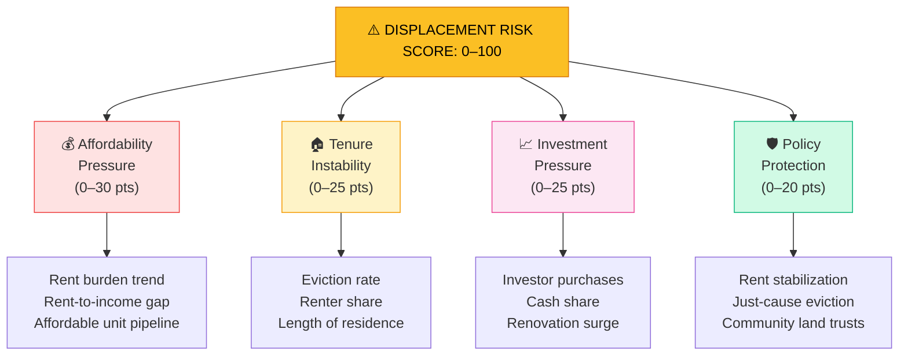

**Risk Tiers**: Critical (75–100) · Elevated (50–74) · Moderate (25–49) · Low (<25)

### Government Accountability Scorecard (Community Trust Pod)

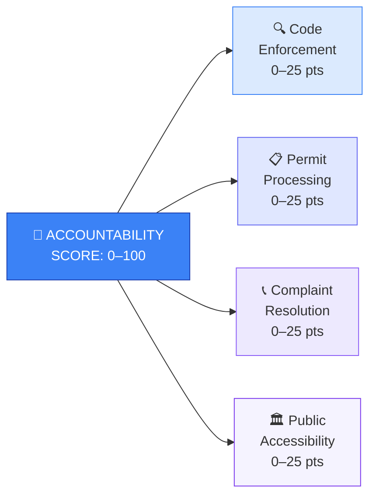

**Score Tiers**: Responsive (85–100) · Functional (70–84) · Needs Improvement (55–69) · Failing (<55)

---

## 📡 Data Sources

All analyses cite **primary, verifiable sources** with vintage dates. No invented data — ever.

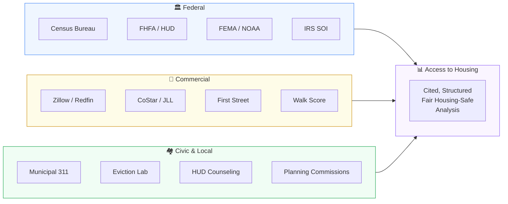

<table>
<tr>
<td width="33%">

**Supply & Permits**
- Census Building Permits
- NAHB Housing Market Index
- CoStar · Dodge Construction
- Public homebuilder earnings

</td>
<td width="33%">

**Pricing & Transactions**
- FHFA HPI · Case-Shiller
- Zillow ZHVI/ZORI
- Redfin Data Center
- NAR · Harvard JCHS

</td>
<td width="33%">

**Migration & Demographics**
- IRS SOI (county-to-county)
- Census ACS estimates
- Redfin migration search
- U-Haul growth markets

</td>
</tr>
<tr>
<td>

**Climate & Risk**
- First Street Foundation
- FEMA FIRM maps
- NOAA sea level projections
- CAL FIRE WUI maps

</td>
<td>

**Infrastructure**
- MPO Transportation Plans
- FTA Capital Grants
- USDOT RAISE grants
- JLL · CBRE Capital Markets

</td>
<td>

**Livability**
- Walk Score / Transit Score
- Trust for Public Land
- FBI UCR/NIBRS
- LEHD LODES employment

</td>
</tr>
<tr>
<td colspan="3">

**Community Trust & Civic Transparency**
- Eviction Lab · NLIHC · HUD Counseling · 211 United Way · Legal Services Corp · Municipal 311 / Open Data Portals

</td>
</tr>
</table>

See [`assets/data-sources.md`](assets/data-sources.md) for the full reference with 85+ sources and direct links.

---

## ⚖️ Fair Housing Compliance

Every module is designed to comply with the **Fair Housing Act**. This is not an afterthought — it is foundational to the architecture.

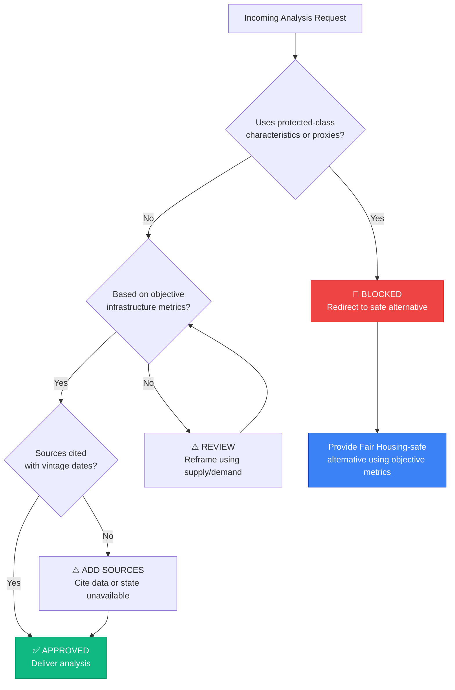

**Core rules:**
- No analysis based on race, color, national origin, religion, sex, familial status, or disability
- No proxy metrics that score on demographics
- School quality scored on **proximity/access only** — never test scores framed demographically
- Crime expressed as **density-normalized rates** — never raw counts
- Neighborhood comparisons use **objective infrastructure metrics only**

See [`FAIR-HOUSING.md`](FAIR-HOUSING.md) for the full compliance framework.

---

## 📁 Repository Structure

```
access-to-housing/
│
├── 📄 README.md                        You are here
├── 🧠 SKILL.md                         Claude skill definition — all 7 core modules
├── ⚖️ FAIR-HOUSING.md                  Compliance framework & checklist
├── 🤝 CONTRIBUTING.md                  How to contribute
├── 📜 LICENSE                           MIT
├── 🧠 CLAUDE.md                        Developer context for Claude Code contributors
│
├── 📂 assets/
│   ├── data-sources.md                 85+ authoritative data sources with links
│   ├── api-reference.md                Developer API guide — endpoints, auth, rate limits
│   ├── output-schemas.md               JSON schemas for all scoring module outputs
│   ├── example-prompts.md              Test prompts for every module with validation checklist
│   ├── sample-output.md                Complete Platform Brief example (Nashville, TN)
│   ├── international-guide.md          Adaptation guide for UK, Canada, Australia markets
│   ├── glossary.md                     Plain-language definitions for non-expert users
│   └── images/logo.svg                 Platform logo
│
├── 📂 references/                       7 analytical pods (80 total modules)
│   ├── market-intelligence/pod.md      16 modules — pricing, supply, cycles, migration
│   ├── investment-deal/pod.md          16 modules — underwriting, portfolio, syndication
│   ├── risk-climate/pod.md              6 modules — climate, zoning, insurance, resilience
│   ├── property-intelligence/pod.md    10 modules — AVM, MLS, rental, pricing strategy
│   ├── brokerage-ops/pod.md            18 modules — CRM, leads, transactions, marketing
│   ├── brokerage-strategy/pod.md       10 modules — growth, recruiting, financial planning
│   └── community-trust/pod.md           6 modules — civic transparency, displacement, accountability
│
├── 📂 docs/                             GitHub Pages supplemental pages
│   ├── reference-pods.md               Pod navigation page
│   └── resources.md                    Resources navigation page
│
├── 📂 _sass/                            GitHub Pages custom styling
├── 📄 _config.yml                       Jekyll / GitHub Pages configuration
├── 📄 index.md                          GitHub Pages home page
├── 📄 Gemfile                           Jekyll dependencies
│
└── 📂 .github/
    ├── workflows/pages.yml              GitHub Pages deployment workflow
    └── ISSUE_TEMPLATE/
        ├── module-request.yml           Request a new analytical module
        ├── data-source.yml              Suggest a data source
        ├── fair-housing-concern.yml     Flag a Fair Housing compliance issue
        └── community-resource.yml       Submit a local housing resource
```

---

## ❓ FAQ

<details>
<summary><strong>Is this an app I can download?</strong></summary>

No — Access to Housing is a **Claude Custom Skill** (a `.skill` file you upload to Claude.ai). It turns Claude into a specialized PropTech intelligence analyst. There's no separate app, database, or server to run. You ask questions in plain English and get structured, cited analysis back. You can also browse all modules, scoring frameworks, and data sources on the [documentation site](https://dougdevitre.github.io/access-to-housing/).
</details>

<details>
<summary><strong>Where does the data come from?</strong></summary>

All analysis references **85+ authoritative public and commercial data sources** — Census Bureau, FHFA, Zillow, Redfin, First Street Foundation, FEMA, Walk Score, Eviction Lab, and more. Every data point cites its source name and vintage date so you can verify it. The platform never invents data. See [`assets/data-sources.md`](assets/data-sources.md) for the full list.
</details>

<details>
<summary><strong>Is this Fair Housing compliant?</strong></summary>

Yes — Fair Housing compliance is **architectural, not an afterthought**. Every module, scoring rubric, and output template is designed to avoid protected class characteristics and proxies. Crime uses density-normalized rates, schools are scored on proximity only, neighborhoods are compared on objective infrastructure metrics. See [`FAIR-HOUSING.md`](FAIR-HOUSING.md) for the full framework.
</details>

<details>
<summary><strong>Can I use this for my local market?</strong></summary>

Yes. The platform works for any US market. Ask about a specific city, county, neighborhood, or metro area. For international markets, the frameworks are adaptable — see [`assets/international-guide.md`](assets/international-guide.md) for country-specific guidance.
</details>

<details>
<summary><strong>I'm a developer — how do I integrate this?</strong></summary>

Start with the [For Developers](#-for-developers) section. Key resources: JSON output schemas ([`assets/output-schemas.md`](assets/output-schemas.md)), data source API reference ([`assets/api-reference.md`](assets/api-reference.md)), example prompts with expected outputs ([`assets/example-prompts.md`](assets/example-prompts.md)), and repo context ([`CLAUDE.md`](CLAUDE.md)).
</details>

<details>
<summary><strong>I'm a housing advocate — how does this help my community?</strong></summary>

The **Community Trust & Transparency Pod** was built specifically for communities. Use the Civic Transparency Tracker to see what zoning decisions your city is making, the Displacement Early Warning to identify neighborhoods at risk, the Government Accountability Scorecard to measure responsiveness, and the Neighborhood Resource Directory to find help. See the [Community Trust Assessment](#community-trust-assessment) workflow.
</details>

<details>
<summary><strong>What does a real output look like?</strong></summary>

See [`assets/sample-output.md`](assets/sample-output.md) for a complete multi-module Platform Brief showing Nashville, TN — including Permit Intelligence, Livability Score, Displacement Early Warning, and Government Accountability Scorecard with cited data points and next steps.
</details>

<details>
<summary><strong>How do I contribute?</strong></summary>

See [`CONTRIBUTING.md`](CONTRIBUTING.md). High-impact areas: local data sources, community resource directories, Fair Housing review, module expansions, and developer tools. We especially welcome Community Trust contributions from people with local knowledge.
</details>

---

## 🌐 CoTrackPro Access Projects

Access to Housing is **pillar #3** of CoTrackPro's five-pillar open-source initiative — making critical intelligence freely accessible.

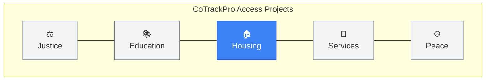

| Pillar | Repository | Focus |
|:------:|-----------|-------|
| ⚖️ | [access-to](https://github.com/CoTrackPro/access-to) | Family law documentation, expungement, protection orders |
| 📚 | [access-to-education](https://github.com/CoTrackPro/access-to-education) | K-12 standards, IEP/504 support, educator tools |
| **🏠** | **access-to-housing** | **PropTech intelligence, Fair Housing-safe analysis** |
| 🤝 | [access-to-services](https://github.com/CoTrackPro/access-to-services) | Legal aid, mental health, advocacy resource navigation |
| ☮️ | *coming soon* | De-escalation, communication, conflict resolution |

---

## 🤝 Contributing

We welcome contributions! See [CONTRIBUTING.md](CONTRIBUTING.md) for full guidelines.

**High-impact contribution areas:**

| Area | Examples |
|------|---------|
| **Data Sources** | Add reliable, publicly accessible sources with API access |
| **Module Expansions** | International markets, regional adaptations, new dimensions |
| **Fair Housing Review** | Identify compliance concerns in existing frameworks |
| **Accessibility** | Plain-language improvements, better output templates |
| **Reference Pods** | New frameworks, case studies, methodology docs |

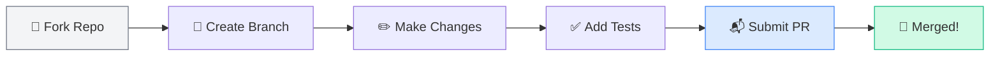

---

## 📜 License & Contact

**MIT License** — open source, use freely, attribute kindly.

**Doug Devitre** — Founder, [CoTrackPro](https://cotrackpro.com)

[](https://linkedin.com/in/dougdevitre)
[](https://github.com/dougdevitre)

---

<div align="center">

**Built with transparency. Designed for compliance. Open to everyone.**

*Star this repo if you believe housing intelligence should be a public good.*

</div>
