# Pod: Brokerage Ops
**18 modules** — CRM, leads, pipeline, buyer/seller workflows, transactions, marketing

```mermaid
flowchart LR
    subgraph CRM ["📇 CRM"]
        A1["CRM Assistant"]
        A2["CRM Health"]
    end

    subgraph LEADS ["🎯 Leads"]
        B1["Lead Gen"]
        B2["Pipeline\nPrioritization"]
        B3["Conversion"]
    end

    subgraph BUYERS ["🏠 Buyers"]
        C1["Buyer Behavior"]
        C2["Search Optimizer"]
        C3["Offer Probability"]
    end

    subgraph SELLERS ["📋 Sellers"]
        D1["Seller Readiness"]
        D2["Feedback AI"]
        D3["Showing Analysis"]
    end

    subgraph CLOSE ["✅ Close"]
        E1["Negotiation"]
        E2["Transaction\nTimeline"]
        E3["Transactions"]
    end

    subgraph GROW ["📈 Grow"]
        F1["Marketing"]
        F2["Marketing\nCalendar"]
        F3["Client\nExperience"]
        F4["Task Optimizer"]
    end

    CRM --> LEADS --> BUYERS --> CLOSE
    CRM --> LEADS --> SELLERS --> CLOSE
    CLOSE --> GROW

    style CRM fill:#dbeafe,stroke:#3b82f6
    style LEADS fill:#fef3c7,stroke:#f59e0b
    style BUYERS fill:#d1fae5,stroke:#10b981
    style SELLERS fill:#fce7f3,stroke:#ec4899
    style CLOSE fill:#ede9fe,stroke:#8b5cf6
    style GROW fill:#fefce8,stroke:#ca8a04
```

---

## Module Index
| Module | Trigger Phrases |
|--------|----------------|
| [CRM Assistant](#crm-assistant) | update CRM, log contact, CRM workflow, follow-up sequence |
| [CRM Health](#crm-health) | how is my database, CRM audit, contact quality, database health |
| [Lead Generation](#lead-generation) | generate leads, lead sources, how do I get more leads |
| [Pipeline Prioritization](#pipeline-prioritization) | prioritize my pipeline, who should I call, hottest leads |
| [Conversion](#conversion) | convert leads, close more deals, conversion rate, appointment set |
| [Offer Probability](#offer-probability) | will they make an offer, offer likelihood, buyer readiness |
| [Buyer Behavior](#buyer-behavior) | buyer psychology, what buyers want, buyer decision patterns |
| [Buyer Search Optimizer](#buyer-search-optimizer) | find properties for buyer, match listings to buyer, search criteria |
| [Seller Readiness](#seller-readiness) | is seller ready to list, seller motivation, listing readiness |
| [Seller Feedback AI](#seller-feedback-ai) | showing feedback, seller report, what buyers are saying |
| [Showing Analysis](#showing-analysis) | showing metrics, showing to offer ratio, showing traffic |
| [Negotiation](#negotiation) | negotiation strategy, how to negotiate this offer, counter offer |
| [Transaction Timeline](#transaction-timeline) | transaction checklist, closing timeline, what happens next |
| [Transactions](#transactions) | manage transaction, closing coordination, contract to close |
| [Client Experience](#client-experience) | client satisfaction, NPS, client retention, referral generation |
| [Marketing](#marketing) | listing marketing, agent marketing, campaign strategy |
| [Marketing Calendar](#marketing-calendar) | content calendar, marketing schedule, campaign planning |
| [Task Optimizer](#task-optimizer) | prioritize my day, time management, what should I work on |

---

## CRM Assistant

**Purpose**: Guide agents in properly maintaining their CRM — contact logging, follow-up
sequencing, pipeline tagging, and data hygiene for consistent database monetization.

**Core CRM Workflow**:
1. **Every contact gets a tag**: Buyer / Seller / Investor / Past Client / Sphere / COI
2. **Every interaction gets logged**: Call, text, email, showing, meeting — with notes
3. **Every lead gets a next action**: Never leave a lead without a scheduled follow-up
4. **Every past client gets a 33-touch plan**: Annual market update + quarterly touchpoints

**Follow-Up Sequence by Lead Temperature**:
| Temperature | Cadence | Channel Mix |
|------------|---------|------------|
| Hot (active, 0–90 days) | Daily–weekly | Call + text + email |
| Warm (6–18 months out) | Monthly | Email + monthly call |
| Cold (18+ months, nurture) | Quarterly | Email newsletter + annual call |
| Past client | 33-touch/yr | Mix of all channels + personal touches |

**CRM Best Practices**:
- One database rule: All contacts in one system, never split across tools
- Mobile-first logging: Log every call immediately from mobile
- Activity score: Contacts with 0 activities in 90 days = database dead weight
- Birthday/anniversary tracking: Highest-ROI personal touch triggers

**Top CRM Platforms**: Follow Up Boss (FUB), Salesforce, kvCORE, LionDesk, HubSpot, Sierra Interactive

---

## CRM Health

**Purpose**: Audit the quality and monetization potential of an agent's or brokerage's
contact database — identify gaps, dead weight, and hidden opportunity.

**CRM Health Scorecard**:
| Metric | Healthy | At Risk | Critical |
|--------|---------|---------|---------|
| Contact completeness (name + phone + email) | >85% | 70–85% | <70% |
| Contacts with tags/categories | >90% | 75–90% | <75% |
| Contacts with last activity <90 days | >60% active | 40–60% | <40% |
| Contacts with scheduled next action | >80% | 60–80% | <60% |
| Past client re-engage rate | >50% transact again | 30–50% | <30% |

**Hidden Opportunity Analysis**:
- Identify contacts with no transaction in 3+ years who own homes (likely equity-rich sellers)
- Segment by zip code → match against high-appreciation submarkets
- Flag contacts who inquired in a price range now within reach

---

## Lead Generation

**Purpose**: Identify, evaluate, and build lead generation systems for consistent top-of-funnel
production aligned with the agent's or team's capacity and ROI targets.

**Lead Source ROI Framework**:
| Source | Avg Cost/Lead | Close Rate | Avg Cost/Closing | Notes |
|--------|--------------|------------|------------------|-------|
| Sphere/referral | ~$0–200 | 12–20% | $500–2,000 | Highest ROI, most agents underlever |
| Zillow Premier Agent | $150–500 | 1–3% | $8,000–25,000 | Volume play, requires fast response |
| Google Ads PPC | $50–200 | 2–5% | $3,000–8,000 | Requires conversion optimization |
| Meta/FB Ads | $10–50 | 1–3% | $2,000–8,000 | Good for brand + retargeting |
| Expired listings | $0–50 | 5–15% | $500–2,000 | High skill, time-intensive |
| FSBO | $0 | 5–12% | $0–500 | Very high skill ceiling |
| Open houses | $100–300/event | 2–5% | $3,000–8,000 | Also generates sphere impressions |
| Past clients | $200–500/yr mktg | 15–25% | $1,000–2,500 | Systemize via 33-touch |

**Lead Response Speed**: Leads contacted within 5 minutes are 21x more likely to convert
than leads contacted after 30 minutes (MIT Lead Response Management Study)

---

## Pipeline Prioritization

**Purpose**: Help agents identify which leads and clients to focus on today for maximum
GCI impact — separating urgency from importance.

**Pipeline Scoring Matrix**:
Score each active lead on two dimensions (1–5 each):

| Dimension | 1 (Low) | 5 (High) |
|-----------|---------|---------|
| Timeline urgency | 12+ months out | Buying/selling in <30 days |
| Probability to close | Very low intent | Pre-approved, motivated |

- Score 8–10: Priority 1 — daily contact
- Score 5–7: Priority 2 — weekly contact
- Score 2–4: Priority 3 — monthly nurture

**Daily Focus Formula**:
1. Review all Priority 1 leads → take action on each
2. Review any new inbound leads → score and route
3. Follow up on yesterday's activities without response
4. One proactive sphere/past client reach-out

---

## Conversion

**Purpose**: Improve lead-to-appointment and appointment-to-client conversion rates
through structured communication scripts and objection handling.

**Key Conversion Metrics**:
- Lead-to-appointment rate: Average agent 5–15%; top performer 20–35%
- Appointment-to-signed-client rate: Average 60–75%; top performer 85–95%
- Average follow-up attempts before contact: 6–8 (most agents quit at 1–2)

**Appointment Setting Framework** (LPMAMA for buyer leads):
- **L**ocation: What areas are you looking in?
- **P**rice: What's your price range?
- **M**otivation: Why are you looking to move?
- **A**bility: Are you pre-approved / working with a lender?
- **M**arket Knowledge: Have you seen anything you like?
- **A**ppointment: "Based on what you've shared, I'd love to set aside 30 minutes..."

**Objection Handling — Top 3**:
1. "Just looking" → "Totally understand. Are you curious what your home is worth in today's market?"
2. "I have an agent" → "That's great — are you under contract with them? No? Then we should talk."
3. "Market is too expensive" → "That's actually why NOW may be the best time — let me show you why."

---

## Offer Probability

**Purpose**: Predict the likelihood that a showing will result in an offer, and identify
actions to increase conversion probability before the showing deadline.

**Offer Probability Signals**:
- Second showing scheduled: 3x more likely to offer than single-showing buyers
- Buyer's agent has called listing agent to ask questions: 2x more likely
- Buyer has measured rooms or asked about schools: High intent signal
- Pre-approval letter submitted with showing request: Very high intent
- Time on market context: Buyers in <2-month supply market show higher urgency

**Pre-Offer Preparation Checklist**:
- [ ] Seller has responded to all showing feedback requests
- [ ] Price is positioned relative to any new competing listings
- [ ] Listing agent has communicated offer deadline (if multiple interest)
- [ ] Disclosure package is complete and available
- [ ] Home is show-ready (checklist sent to seller)

---

## Buyer Behavior

**Purpose**: Understand buyer decision-making psychology and behavior patterns to improve
representation, communication, and transaction management.

**Buyer Decision Stages** (NAR Research):
1. **Trigger**: Life event (job change, family growth, divorce, relocation)
2. **Research**: Online portal browsing begins avg 12 months before purchase
3. **Contact**: Agent contact typically begins 3–4 months before purchase
4. **Active Search**: 10 homes toured on average before offer
5. **Decision**: Final decision often within 15 minutes of seeing right home

**Buyer Motivation Categories**:
- Financial (equity building, low rates, investment)
- Life stage (marriage, kids, divorce, retirement)
- Lifestyle (neighborhood, schools, walkability)
- Status (first home, upgrade, lifestyle statement)

**Communication Preferences by Demographic**:
- Millennials / Gen Z: Text-first, portal-native, high research orientation
- Gen X: Email + phone, value agent expertise, transactional efficiency
- Boomers: Phone preference, relationship-driven, trust established over time

---

## Buyer Search Optimizer

**Purpose**: Match buyers to available inventory more efficiently by structuring search
criteria, setting appropriate expectations, and sequencing property tours.

**Search Criteria Framework** (must-have vs. nice-to-have):
- Must-have: Non-negotiable (bedrooms, school district, price ceiling)
- Nice-to-have: Would pay for but won't walk without (garage, updated kitchen)
- Bonus: Unexpected positive (pool, great view, extra lot)

**Tour Sequencing Strategy**:
1. Start with a strong but not perfect property (sets baseline, not too exciting)
2. Show the "close but not quite" — helps buyer articulate what's missing
3. Show the target property — primed by contrast
4. Have a backup that meets core criteria at lower price

**Expectation-Setting Script**:
"In this market, homes that check all the boxes are moving in X days. When we find the right
one, you'll want to be ready to decide quickly. Let's make sure your pre-approval is current."

---

## Seller Readiness

**Purpose**: Assess whether a potential seller is genuinely ready to list and identify
the conversations needed to move them from inquiry to signed listing agreement.

**Seller Readiness Assessment**:
| Factor | Ready Signal | Not Ready Signal |
|--------|-------------|-----------------|
| Motivation | Job relocation, life event, financial need | "Just curious what it's worth" |
| Timeline | List in 30–60 days | "Maybe next year" |
| Equity position | Knows they have equity, excited | Underwater or uncertain |
| Next home | Has plan for where they're going | No plan — fear of not finding something |
| Pricing | Realistic about market value | Anchored to Zillow or neighbor's sale |

**Stalled Seller Strategy**:
- Fear of not finding next home → Show them inventory availability in target area first
- Uncertain about value → Deliver a thorough CMA, not just a Zestimate
- Waiting for perfect market → Share holding cost math vs. current opportunity

---

## Seller Feedback AI

**Purpose**: Aggregate, analyze, and present showing feedback to sellers in a way that
is constructive, data-driven, and moves the listing toward sale.

**Feedback Collection System**:
- Send showing feedback request within 2 hours of showing (ShowingTime auto-request)
- Structured form: Price (too high / fair / great value), Condition, Layout, Competition
- Follow up by phone if no response after 24 hours (buyer agent direct)

**Presenting Feedback to Sellers**:
- Aggregate at least 5 showings before drawing conclusions
- Present patterns, not individual opinions ("Three of five buyers mentioned...")
- Frame as market data, not personal criticism
- Always pair feedback with a recommended action

**Price Reduction Conversation Framework**:
1. Present showing count vs. market average (quantify the problem)
2. Share feedback pattern (validate with multiple voices)
3. Present competitive analysis (what's sold, what's pending, what's competing)
4. Make a specific recommendation with expected outcome

---

## Showing Analysis

**Purpose**: Use showing data to diagnose listing health, predict offer probability,
and benchmark against market norms.

**Showing KPIs**:
| Metric | Healthy Signal | Warning Signal |
|--------|---------------|---------------|
| Showings in first 7 days | 5–10+ (seller's mkt) | <3 (any market) |
| Showing-to-offer ratio | 8–12 showings per offer | >20 showings, no offers |
| Return showings | 30%+ request 2nd look | <10% return |
| Showing feedback response rate | >60% | <30% |

**ShowingTime Data**: If agent has ShowingTime access, pull: total showings, peak days/times,
feedback scores, and compare to market median for similar properties.

---

## Negotiation

**Purpose**: Develop negotiation strategy and scripts for offer situations — representing
buyers or sellers across price, terms, repairs, and contingencies.

**Negotiation Principles**:
1. Anchor high (seller) or specific (buyer) — vague first offers invite vague counters
2. Never negotiate against yourself — always get a counter before changing position
3. Use non-price terms strategically (close date, inspection period, rent-back)
4. Know your BATNA (Best Alternative To Negotiated Agreement) before you need it
5. Create urgency without creating pressure — deadlines work; ultimatums backfire

**Seller Counter Framework**:
- Price: Counter within 2–3% of ask on first offer unless offer is <90% of list
- Inspection: Offer repair credit vs. making repairs (credit gives certainty)
- Contingencies: Push back on appraisal waiver requests with market data
- Close date: Flexible close date is often worth $5,000–10,000 in price concession

**Buyer Offer Strategy**:
- Escalation clause: Use in multiple-offer situations (cap 3–5% above list)
- Pre-approval letter: Match to offer price (not max) to avoid showing full capacity
- Personal letter: Jurisdiction-dependent (some MLSs prohibit for Fair Housing reasons)
- Due diligence period: Shorter = stronger; pre-inspection removes contingency entirely

---

## Transaction Timeline

**Purpose**: Manage the contract-to-close process with a clear checklist, deadline tracking,
and proactive communication to all parties.

**Standard Transaction Timeline** (30-day close):
| Day | Milestone |
|-----|----------|
| 0 | Contract executed, earnest money due |
| 1–3 | Earnest money deposited, intro email to all parties |
| 1–10 | Inspection period (negotiate repairs by day 10) |
| 3–5 | Title ordered, preliminary title report |
| 5–7 | Loan application submitted (if not done pre-offer) |
| 7–14 | Appraisal ordered and completed |
| 14–21 | Loan approval (clear to close target) |
| 21–28 | Final walkthrough scheduled |
| 28–30 | Closing disclosure (3 days before close required) |
| 30 | Close of escrow, keys transferred |

**Common Delay Points**: Appraisal scheduling (5–10 day lag), loan conditions, title issues,
HOA document delays, repair completion verification

---

## Transactions

**Purpose**: Operational system for managing multiple concurrent transactions — coordination,
document management, deadline tracking, and party communication.

**Transaction Coordinator Checklist**:
- [ ] Contract received and fully executed
- [ ] Earnest money confirmed received by escrow
- [ ] Disclosure packages sent and acknowledged
- [ ] Inspection scheduled and report received
- [ ] Repair request submitted and negotiated
- [ ] Appraisal ordered, result received
- [ ] Loan approval received
- [ ] HOA documents ordered and reviewed
- [ ] Title commitment received and reviewed
- [ ] Closing disclosure reviewed by all parties
- [ ] Final walkthrough completed
- [ ] Wiring instructions verified (fraud prevention — always verify by phone)
- [ ] Commission disbursement authorization signed

**Wiring Fraud Prevention**: ALWAYS verify wiring instructions by phone to a known number
before any wire transfer. This is the #1 wire fraud vector in real estate transactions.

---

## Client Experience

**Purpose**: Build systems for exceptional client experience that drives referrals,
repeat business, and reviews.

**Client Experience Touchpoints**:
- Pre-transaction: Market update, prep guide, expectation setting
- During transaction: Weekly check-in minimum, proactive updates at every milestone
- Post-close: 1-week, 1-month, 6-month, 1-year check-ins
- Ongoing: Annual equity update, market newsletter, personal holiday touch

**NPS and Review Generation**:
- Ask for review within 48–72 hours of closing (highest emotional moment)
- Text-first request with direct Google review link
- Follow up with Zillow review request if Google complete
- Target: 1 review per 3 transactions minimum

**Referral Generation**:
"Who do you know who might be thinking about buying or selling in the next 6–12 months?"
— Ask at closing, at 6-month check-in, and at 1-year anniversary

---

## Marketing

**Purpose**: Develop integrated marketing campaigns for listings and agent brand — digital,
print, social, and direct mail — with ROI tracking.

**Listing Marketing Checklist**:
- [ ] Professional photography (HDR, natural light, 25+ photos)
- [ ] Virtual tour / Matterport 3D scan
- [ ] Video walkthrough (60-90 seconds for social)
- [ ] Drone photography (if permitted and adds value)
- [ ] MLS listing with SEO-optimized description
- [ ] Syndicated to Zillow, Redfin, Realtor.com, Homes.com
- [ ] Just-listed postcard to 100–200 nearest neighbors
- [ ] Social posts: FB, Instagram, LinkedIn (property + agent profile)
- [ ] Email blast to buyer list and sphere
- [ ] Open house (first weekend, 2pm–4pm Saturday and Sunday)

**Agent Marketing Stack**:
- Website: IDX-enabled, SEO-optimized, lead-capture
- CRM: Automated follow-up sequences
- Social: 3–5 posts/week cadence (market updates, listings, community content)
- Email: Monthly newsletter (market stats + personal content)
- Video: YouTube channel for hyperlocal content

---

## Marketing Calendar

**Purpose**: Build a 12-month content and campaign calendar aligned with real estate
seasonality, local events, and agent business goals.

**Seasonal Content Calendar**:
| Month | Real Estate Content | Market Theme |
|-------|-------------------|-------------|
| Jan | Year-in-review stats, buyer prep guide | New year, fresh start |
| Feb | Affordability update, Valentine's home tips | Love where you live |
| Mar | Spring market preview, seller prep checklist | Spring listing season |
| Apr–May | Peak listing season — market reports, just-listed content | Seller's market stories |
| Jun | Summer buying guide, school district content | Family moves |
| Jul | Mid-year market update, vacation home content | Summer investing |
| Aug | Back-to-school neighborhood guides | Family focus |
| Sep | Fall market preview, year-end seller urgency | Decision season |
| Oct–Nov | Before year-end benefits, holiday home staging | Serious buyers active |
| Dec | Year-end market stats, appreciation reports, predictions | Wrap up + plan ahead |

---

## Task Optimizer

**Purpose**: Help agents prioritize their daily activities for maximum GCI production —
separating revenue-generating activities from administrative tasks.

**Income-Producing Activity (IPA) Framework**:
IPAs = activities that directly generate leads or move transactions forward:
- Prospecting calls (sphere, expired, FSBO, past clients)
- Lead follow-up and nurture
- Listing presentations
- Buyer consultations
- Offer negotiations
- Transaction management communication

**Time Allocation Target**:
- Top producer: 4+ hours/day on IPAs
- Growing agent: 2–3 hours/day on IPAs
- Administrative: Cap at 2 hours/day (automate or delegate the rest)

**Daily Priority Formula**:
1. Any active client communication needing response (same-day rule)
2. Pipeline follow-up for Priority 1 leads
3. One prospecting activity (call 5–10 people from sphere/database)
4. One lead follow-up sequence action
5. Administrative batch (end of day, capped at 60 min)
