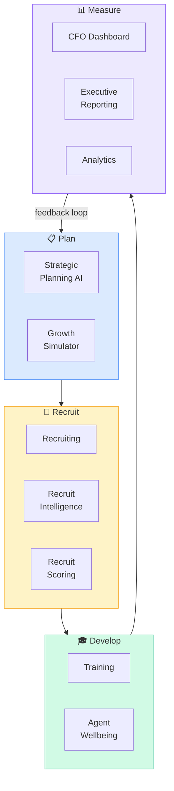

# Pod: Brokerage Strategy
**10 modules** — brokerage growth, recruiting, financial modeling, executive reporting, agent development



---

## Module Index
| Module | Trigger Phrases |
|--------|----------------|
| [Brokerage Growth Simulator](#brokerage-growth-simulator) | model brokerage growth, what if I hire 10 agents, revenue projection |
| [Recruiting](#recruiting) | recruit agents, attract talent, grow the team |
| [Recruit Intelligence](#recruit-intelligence) | research agent to recruit, agent production data, competitor agents |
| [Recruit Scoring](#recruit-scoring) | score recruits, rank candidates, who should I recruit first |
| [Strategic Planning AI](#strategic-planning-ai) | strategic plan, annual goals, business planning, growth strategy |
| [CFO Dashboard](#cfo-dashboard) | brokerage financials, P&L, revenue per agent, cost analysis |
| [Executive Reporting](#executive-reporting) | broker-owner report, leadership dashboard, KPI reporting |
| [Analytics](#analytics) | production analytics, agent performance, market share |
| [Training](#training) | agent training, onboarding, skill development, coaching |
| [Agent Wellbeing](#agent-wellbeing) | agent burnout, retention, culture, team health |

---

## Brokerage Growth Simulator

**Purpose**: Model the financial impact of growth scenarios — adding agents, expanding
markets, changing commission splits, investing in technology — before committing resources.

**Core Brokerage P&L Model**:

**Revenue Drivers**:
- Agent count × Average GCI per agent × Company dollar split %
- Ancillary revenue: Mortgage, title, insurance referral fees
- Franchise fees (if applicable): Cap structure or fixed %

**Expense Drivers**:
- Fixed: Rent, technology stack, staff salaries, marketing
- Variable: Recruiting costs, training, per-agent support costs
- Step-fixed: Each 50 agents added may require 1 more admin or manager

**Growth Scenario Template**:
```
Current State: [X agents | $X avg GCI | X% company dollar | $X revenue | $X EBITDA]
Scenario A (+10 agents, same profile): [projected revenue | marginal cost | net EBITDA]
Scenario B (+10 agents, higher producers): [projected revenue | marginal cost | net EBITDA]
Scenario C (technology investment -$X): [productivity improvement assumption | payback period]
```

**Key Benchmarks** (T3 Sixty, RealTrends):
- Revenue per agent: High-performance brokerages >$30K/agent/yr
- EBITDA margin: Healthy independent brokerage 15–25%
- Technology spend per agent: $500–$1,500/yr industry average

---

## Recruiting

**Purpose**: Build and execute a systematic agent recruiting program — sourcing, outreach,
value proposition, and onboarding pipeline.

**Recruiting Value Proposition Framework**:
Agents move for one of five reasons:
1. **More money**: Better split, cap structure, revenue share
2. **More leads**: Lead generation platform, referral network
3. **More support**: Training, admin, TC, marketing
4. **More tools**: CRM, technology, brand
5. **More culture**: Community, brand identity, leadership quality

Match your pitch to the agent's primary driver — don't lead with culture if they want more leads.

**Recruiting Pipeline Stages**:
1. Sourced → identified as potential recruit
2. Contacted → initial outreach made
3. Engaged → conversation started, showing interest
4. Presenting → value proposition meeting scheduled
5. Negotiating → discussing terms
6. Signed → joining confirmed
7. Onboarded → first 90 days complete

**Outreach Cadence**: Initial contact → 3-day follow-up → 7-day follow-up → 14-day follow-up →
Monthly nurture until decision point

---

## Recruit Intelligence

**Purpose**: Research and analyze specific agents as recruiting targets — production data,
market share, social presence, perceived satisfaction with current brokerage.

**Agent Research Sources**:
- MLS production data: Transactions closed, total volume, average price point, market
- State license lookup: License status, years licensed, any disciplinary action
- Social media: Activity level, brand tone, complaints about current brokerage
- Zillow/Realtor.com profile: Reviews, years experience, recent activity
- RealTrends / T3 Sixty agent rankings (top producers)
- Word of mouth: Ask current agents about their peer network

**Trigger Events for Recruiting Outreach**:
- Agent at competing brokerage closes unusually large deal (visible in MLS)
- Agent posts publicly about frustration with tools or support
- Brokerage acquisition or merger leaves agents uncertain
- Top agent loses a key team member — may be looking to move the team
- Agent hits production plateau — may want new environment

**Profile Template**:
```
Agent: [Name] | Brokerage: [Current] | Years Licensed: [X]
2024 Production: [X transactions | $X volume | Avg $X price]
Strengths: [market, specialty, reputation]
Motivation Hypothesis: [why they might move — split, leads, tools, culture]
Recommended Approach: [tailored value prop]
Next Action: [call, email, LinkedIn, referral introduction]
```

---

## Recruit Scoring

**Purpose**: Rank recruiting candidates systematically to prioritize outreach effort
on the highest-value, highest-probability targets.

**Scoring Dimensions** (each 1–5):

| Dimension | 1 | 5 |
|-----------|---|---|
| Production volume | <$1M/yr | >$10M/yr |
| Production growth | Declining | Growing 20%+/yr |
| Fit with brokerage culture | Poor | Excellent |
| Probability to move (triggers present) | Low | High |
| Relationship warmth (do we know them?) | Cold outreach | Warm referral |

**Total Score 20–25**: Priority A — personal outreach by broker-owner this week
**Total Score 15–19**: Priority B — outreach within 30 days
**Total Score 10–14**: Priority C — add to monthly nurture
**Total Score <10**: Pipeline only, wait for trigger event

---

## Strategic Planning AI

**Purpose**: Build a structured annual strategic plan for a brokerage or individual
agent business — goals, strategies, initiatives, and tracking cadence.

**Strategic Planning Framework**:

**Step 1: Assess Current State**
- Production: Closings, volume, GCI (last 12 months)
- Market share: % of transactions in target market
- Strengths, weaknesses, opportunities, threats (SWOT)

**Step 2: Define Goals** (SMART format)
- Revenue/GCI goal: Specific $ target with basis
- Transaction count: # of transactions required to hit revenue goal
- Growth metric: New agents (brokerage) or new clients (individual)
- Market position: Ranking or share goal

**Step 3: Identify Strategies** (how to achieve goals)
- Each goal needs 2–3 specific strategies
- Each strategy needs a lead metric (activity) and lag metric (outcome)

**Step 4: Build Initiative Calendar**
- Q1: Foundation (systems, database, planning)
- Q2: Growth (campaigns, recruiting, listings season)
- Q3: Momentum (mid-year review, adjust)
- Q4: Close strong + plan next year

**Step 5: Review Cadence**
- Weekly: Activity tracking (IPAs, calls, appointments)
- Monthly: Lagging metric review (deals, revenue)
- Quarterly: Strategic review and adjust

---

## CFO Dashboard

**Purpose**: Give broker-owners and team leaders a clear financial picture of brokerage
health — revenue, expenses, agent economics, and trend analysis.

**Key Financial Metrics**:

**Revenue**:
- Gross Company Dollar (GCD): Total commission revenue retained
- GCD per agent: Benchmark target >$20K (healthy), >$30K (high-performance)
- Revenue concentration: Top 20% of agents should not generate >60% of revenue

**Expenses**:
- Fixed cost ratio: Fixed ÷ Total revenue (target <50%)
- Cost per agent: All fixed + variable costs ÷ agent count
- Technology ROI: GCD attributable to tech-sourced leads ÷ tech spend

**Profitability**:
- EBITDA margin: Target 15–25% for independent brokerage
- Break-even agent count: Fixed costs ÷ average GCD per agent
- Marginal agent economics: Revenue added by next agent hire vs. marginal cost

**Cash Flow Watch**:
- Commission cycle: Time from contract to close to commission receipt (typically 30–60 days)
- Payroll vs. commission timing mismatch risk
- Reserve requirement: Minimum 3 months of fixed expenses in operating reserve

---

## Executive Reporting

**Purpose**: Build and deliver leadership dashboards and periodic reports for broker-owners,
team leaders, and investors — combining operational metrics with strategic context.

**Monthly Executive Report Structure**:

```
1. Headline Numbers (top of page)
   - Closings: [X this month | X YTD | vs. goal]
   - Volume: [$X this month | $X YTD | vs. goal]
   - GCI: [$X this month | $X YTD | vs. goal]
   - Agent count: [X active | X new | X departed]

2. Pipeline Health
   - Active listings: [count | avg DOM | avg list price]
   - Pending contracts: [count | projected close value]
   - Active buyer clients: [count | avg price point]

3. Agent Performance
   - Top 10 by production (volume + GCI)
   - Agents with zero activity past 60 days (risk)
   - New agent ramp: 0–6 month cohort transactions

4. Market Context
   - Days on market trend
   - List-to-sale ratio
   - Months of supply
   - Interest rate snapshot

5. Financial Summary
   - Revenue vs. plan
   - Key expense variances
   - EBITDA vs. prior month

6. Strategic Initiatives Update
   - Each initiative: Status | % complete | Next milestone
```

---

## Analytics

**Purpose**: Build data-driven performance management for brokerages and teams —
agent production analysis, market share tracking, and competitive benchmarking.

**Core Analytics Dimensions**:

**Production Analytics**:
- Transactions per agent per year (industry average: 6–8; top producer: 20+)
- Volume per agent (average varies dramatically by price point)
- GCI per agent (target >$75K for viable solo agent career)
- Average days from lead to close (measures pipeline velocity)
- Lead source attribution (which sources are producing closings, not just leads)

**Market Share Analysis**:
- Brokerage share of total market transactions (MLS data)
- Share by price band, neighborhood, property type
- Trend: growing, stable, or losing share?
- Competitor comparison (top 3 competitors by transaction count)

**Cohort Analysis** (agent retention):
- Year-1 retention: % of agents hired who close at least 1 deal
- Year-3 retention: % still active 3 years post-hire
- Production ramp: Average transactions in months 1–3, 4–6, 7–12

---

## Training

**Purpose**: Design and deliver agent training programs — onboarding, skill development,
product knowledge, and coaching systems.

**Onboarding Track** (first 90 days):
| Week | Focus |
|------|-------|
| 1 | Systems setup, CRM, tools orientation, compliance |
| 2–3 | Scripts: prospecting, buyer consult, listing presentation |
| 4 | Database build: 100+ contacts loaded and tagged |
| 5–6 | Shadowing experienced agents: 3 showings, 1 listing presentation |
| 7–8 | First independent leads with manager support |
| 9–12 | First transaction goal; accountability review weekly |

**Ongoing Training Cadence**:
- Weekly team meeting: 30 min role-play or script practice
- Monthly market update: Market stats + strategy review
- Quarterly skill deep-dive: One topic in depth (negotiation, pricing, prospecting)
- Annual planning session: Goal setting + business plan review

**Training Content Topics**:
- Scripts and objection handling (prospecting, listing, buyer)
- CMA preparation and pricing presentation
- Contract writing and negotiation
- Technology and CRM proficiency
- Fair Housing compliance (required annually in most states)
- Marketing: listing marketing, personal brand

---

## Agent Wellbeing

**Purpose**: Monitor and support agent mental health, work-life balance, and career
sustainability — because burnout and attrition are the primary drag on brokerage growth.

**Wellbeing Risk Signals**:
- Production drop >30% for 2+ consecutive months
- Social withdrawal from team culture and events
- Increasing complaint frequency or negative attitude in meetings
- Disclosed personal stress (financial, health, relationship)
- Loss of key team member or referral partner

**Retention-Focused Conversations**:
- 90-day new agent check-in (before they give up)
- Mid-year business review (before they start looking elsewhere)
- Annual life-priorities conversation (not just production review)

**Sustainable Production Model**:
- Avoid encouraging agents to work 7 days/week as a badge of honor
- Set-hours model: 5 days/week with protected personal time
- Batch showing days: Group showings to reduce reactive scheduling
- Delegation milestones: When to hire an assistant (typically 20+ transactions/year)

**Culture Indicators**:
- Agent referral rate for recruiting (% of new hires referred by existing agents)
- eNPS (employee NPS): "How likely are you to recommend working here?"
- Voluntary departure rate: Target <15%/year for healthy retention
