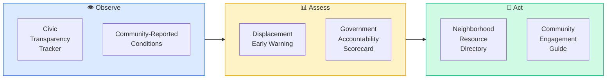

# Pod: Community Trust & Transparency
**6 modules** — civic transparency, community-reported conditions, displacement early warning, government accountability, neighborhood resources, community engagement



---

## Module Index
| Module | Trigger Phrases |
|--------|----------------|
| [Civic Transparency Tracker](#civic-transparency-tracker) | zoning hearing, council vote, public comment, rezoning decision, land use hearing |
| [Community-Reported Conditions](#community-reported-conditions) | neighborhood conditions, housing complaints, 311 data, code violations, resident reports |
| [Displacement Early Warning](#displacement-early-warning) | gentrification risk, displacement, eviction trends, rent burden, longtime residents |
| [Government Accountability Scorecard](#government-accountability-scorecard) | government response, code enforcement, complaint resolution, permit delays, inspection backlog |
| [Neighborhood Resource Directory](#neighborhood-resource-directory) | community resources, legal aid, housing counseling, tenant rights, mutual aid |
| [Community Engagement Guide](#community-engagement-guide) | how to participate, public hearing, neighborhood association, civic engagement, community voice |

---

## Civic Transparency Tracker

**Purpose**: Surface local government decisions that directly affect housing — zoning changes,
variance approvals, tax incentive districts, demolition permits, and public land dispositions —
so residents and stakeholders can see what's happening before it's too late to participate.

**Why This Builds Trust**: Housing decisions often happen in council chambers and planning
commission meetings that residents don't know about until construction begins. Transparency
is the foundation of public trust.

**Key Data Sources**:
- Municipal council meeting minutes and agendas (city clerk websites)
- Planning commission hearing schedules and decisions
- Zoning board of appeals records
- Public notice filings (legal newspapers, municipal websites)
- FOIA/Sunshine Law request portals
- Municode (municode.com) — municipal code and ordinance databases
- National Zoning Atlas (zoningatlas.org) — statewide zoning maps
- Regrid (regrid.com) — parcel-level zoning and ownership data

**Decision Categories Tracked**:

| Category | What to Monitor | Impact Signal |
|----------|----------------|---------------|
| **Rezoning** | Agricultural/residential → commercial/mixed-use changes | Supply pipeline shift, displacement risk |
| **Variance Approvals** | Setback, density, height, use exceptions | Spot development, neighborhood character change |
| **Tax Incentive Districts** | TIF, PILOT, Opportunity Zones, abatement programs | Capital flow direction, who benefits |
| **Demolition Permits** | Residential teardowns, commercial clearing | Displacement, redevelopment signals |
| **Public Land Disposition** | Government-owned parcel sales or leases | Community benefit vs. private gain |
| **Moratoriums** | Rent control, development freezes, STR bans | Market intervention, political signals |

**Analysis Framework**:
1. Decision inventory: What actions has the local body taken in the last 12 months?
2. Pattern detection: Are decisions clustering in specific neighborhoods?
3. Beneficiary analysis: Who benefits — existing residents or outside capital?
4. Public participation rate: How many residents commented or attended?
5. Consistency check: Do decisions align with the comprehensive plan?

**Output Format**:
```
## Civic Transparency Tracker — [Jurisdiction]

**Signal Summary**: [One-line assessment of local government housing decision patterns]

**Recent Decision Inventory** (last 12 months):
| Date | Body | Action | Location | Vote | Public Comments |
|------|------|--------|----------|------|-----------------|
| [date] | [council/commission] | [action] | [area] | [Y-N] | [count] |

**Pattern Analysis**:
- Geographic clustering: [where decisions concentrate]
- Decision direction: [pro-development / preservation / mixed]
- Public participation: [high / low / declining trend]

**Comprehensive Plan Alignment**: [consistent / diverging — with specifics]

**Data Caveats**: [meeting minutes availability, FOIA response times, data gaps]

**Next Steps**:
- [ ] Subscribe to planning commission agendas
- [ ] Attend next public hearing on [specific upcoming item]
- [ ] Request FOIA for [specific decision documentation]
- [ ] Review comprehensive plan for consistency with recent decisions
```

---

## Community-Reported Conditions

**Purpose**: Capture ground-level neighborhood conditions that official data sources miss —
housing quality issues, infrastructure deterioration, safety concerns, and service gaps reported
by residents through municipal systems and community organizations.

**Why This Builds Trust**: Top-down data (satellites, permits, price indices) tells you what's
being built and sold. Community-reported data tells you what it's actually like to live there.
Both perspectives are necessary for honest neighborhood assessment.

**Key Data Sources**:
- Municipal 311/service request systems (open data portals)
- Code enforcement complaint and violation records
- Housing authority inspection reports (HUD REAC scores for public housing)
- Local health department housing complaints
- Utility shutoff and weatherization assistance data
- Open data portals: data.gov, city-level open data (e.g., data.cityofchicago.org)
- HUD Affirmatively Furthering Fair Housing (AFFH) data and mapping tool

**Condition Categories**:

| Category | Indicators | Source |
|----------|-----------|--------|
| **Housing Quality** | Code violations per 100 units, lead paint citations, habitability complaints | Code enforcement, health dept |
| **Infrastructure** | Pothole/sidewalk complaints, streetlight outages, water quality notices | 311 systems, utility reports |
| **Environmental** | Illegal dumping reports, brownfield proximity, air quality complaints | EPA, 311, state DEQ |
| **Service Gaps** | Transit deserts, food deserts (USDA), healthcare access gaps | USDA Food Access Atlas, transit agencies |
| **Safety (Infrastructure)** | Street lighting density, crosswalk conditions, ADA compliance | Municipal public works, 311 |

**Analysis Framework**:
1. Complaint volume and density: Normalize per 1,000 households (not raw counts)
2. Response time analysis: How quickly does the municipality address reported issues?
3. Resolution rate: What percentage of complaints are resolved within 30/60/90 days?
4. Trend direction: Are conditions improving or deteriorating over 3 years?
5. Equity distribution: Are response times and resolution rates consistent across neighborhoods?

**Fair Housing Note**: All analysis uses complaint rates normalized for housing density. No
demographic overlays. Equity analysis compares municipal response quality across areas — it
does not analyze who lives there, only whether government serves all areas equally.

**Output Format**:
```
## Community-Reported Conditions — [Neighborhood/Jurisdiction]

**Signal Summary**: [One-line assessment of ground-level conditions and government responsiveness]

**Condition Dashboard**:
| Category | Complaints/1K HH | Trend (3yr) | Avg Response | Resolution Rate |
|----------|:-----------------:|:-----------:|:------------:|:---------------:|
| Housing Quality | [X] | [↑/↓/→] | [X days] | [X%] |
| Infrastructure | [X] | [↑/↓/→] | [X days] | [X%] |
| Environmental | [X] | [↑/↓/→] | [X days] | [X%] |
| Service Gaps | [X] | [↑/↓/→] | [X days] | [X%] |

**Top Issues**: [Ranked by volume and severity]

**Response Equity**: [Are all neighborhoods served equally? Compare response times across areas]

**Data Caveats**: [311 data availability, reporting bias, underreported conditions]

**Next Steps**:
- [ ] Cross-reference with code enforcement violation database
- [ ] Compare response times to peer cities
- [ ] Identify areas with low complaint volume (may indicate underreporting, not absence of issues)
```

---

## Displacement Early Warning

**Purpose**: Identify neighborhoods where investment, redevelopment, or policy changes are
likely to displace existing residents — before it happens. Investment that the Infrastructure
Growth Heatmap (Module 5) flags as opportunity may simultaneously create displacement risk
for current residents.

**Why This Builds Trust**: When a platform only tracks investment as upside, it serves
investors but not communities. Tracking displacement risk alongside opportunity signals
demonstrates that the platform values existing residents, not just capital returns.

**Key Data Sources**:
- Census ACS — median household income, rent burden (>30% and >50% of income)
- Census ACS — housing tenure (owner vs. renter ratio), length of residence
- Eviction Lab (evictionlab.org) — eviction filing rates by geography
- USPS vacancy data (HUD Aggregated USPS Administrative Data on Address Vacancies)
- Building permit data — renovation vs. new construction ratio
- Property transaction records — cash purchase percentage, investor purchase share
- Local rent stabilization/control registries (where applicable)
- National Low Income Housing Coalition (nlihc.org) — affordable housing inventory

**Displacement Risk Indicators**:

| Indicator | Data Source | Risk Signal |
|-----------|-----------|-------------|
| **Rent burden increase** | ACS | >50% of renters spending >30% on housing |
| **Eviction filing rate** | Eviction Lab | Above metro average, rising trend |
| **Investor purchase share** | Property records | >25% of transactions to non-owner-occupants |
| **Cash purchase percentage** | Property records | Rising share indicates institutional buyers |
| **Renovation permit surge** | Permit data | Renovation permits outpacing new construction |
| **Affordable unit loss** | NLIHC, HUD | Expiring LIHTC, Section 8 contract expirations |
| **Rent growth vs. income growth** | ACS, BLS | Rent growing 2x+ faster than area median income |
| **Small business turnover** | Business license data | Rapid turnover indicates commercial displacement |

**Displacement Risk Score (0–100)**:

| Dimension | Weight | Metrics |
|-----------|:------:|---------|
| **Affordability Pressure** | 30 | Rent burden trend, rent-to-income gap, affordable unit pipeline |
| **Tenure Instability** | 25 | Eviction rate, renter share, length of residence declining |
| **Investment Pressure** | 25 | Investor purchases, cash share, renovation surge, property tax increases |
| **Policy Protection** | 20 | Rent stabilization, just-cause eviction, right of first refusal, community land trusts |

**Risk Tiers**: Critical (75–100) / Elevated (50–74) / Moderate (25–49) / Low (<25)

**Trend Modifier**: Accelerating (+10) / Stable (±0) / Decelerating (-10) over 3 years

**Fair Housing Note**: Displacement analysis uses economic and housing-market indicators only.
No demographic composition analysis. The question is "are residents being priced out?" — not
"who are the residents?"

**Output Format**:
```
## Displacement Early Warning — [Neighborhood/Area]

**Signal Summary**: [One-line displacement risk assessment]

**Displacement Risk Score**: [X/100] — [Tier]
| Dimension | Score | Key Driver |
|-----------|:-----:|-----------|
| Affordability Pressure | [X/30] | [primary metric] |
| Tenure Instability | [X/25] | [primary metric] |
| Investment Pressure | [X/25] | [primary metric] |
| Policy Protection | [X/20] | [presence/absence of protections] |

**Trend**: [Accelerating / Stable / Decelerating] — [3-year trajectory]

**Converging Signals**:
- [Signal 1 with data and source]
- [Signal 2 with data and source]
- [Signal 3 with data and source]

**Protective Factors**: [Existing policies, community land trusts, tenant protections]

**Data Caveats**: [Eviction data lag, informal displacement not captured, ACS margins of error]

**Next Steps**:
- [ ] Cross-reference with Infrastructure Growth Heatmap (Module 5) for investment overlap
- [ ] Identify expiring affordable housing contracts (LIHTC, Section 8)
- [ ] Review local tenant protection ordinances
- [ ] Connect with community organizations tracking displacement
```

---

## Government Accountability Scorecard

**Purpose**: Measure how effectively local government responds to housing-related issues —
code enforcement, permit processing, inspection timelines, complaint resolution, and public
meeting accessibility. Accountability is not about politics; it's about whether government
systems are working for residents.

**Why This Builds Trust**: Residents lose trust when they report problems and nothing happens.
Measuring government responsiveness with data — not opinion — creates accountability and
highlights where systems need improvement.

**Key Data Sources**:
- Municipal code enforcement databases (violation, inspection, resolution records)
- Building permit processing time records (application to approval)
- 311/service request response and resolution data
- Housing authority wait list data (HUD PIC/IMS)
- Public meeting accessibility records (ADA compliance, language access, virtual options)
- Government transparency indices (US PIRG, Sunshine Review)
- Municipal budget documents (housing-related line items)

**Scorecard Dimensions (0–100)**:

| Dimension | Weight | Metrics |
|-----------|:------:|---------|
| **Code Enforcement** (0–25) | 25 | Avg days violation-to-inspection, inspection-to-resolution, repeat violation rate |
| **Permit Processing** (0–25) | 25 | Avg days application-to-approval (residential), rejection rate, resubmission rate |
| **Complaint Resolution** (0–25) | 25 | 311 response time, resolution rate within 30 days, resident satisfaction (if surveyed) |
| **Public Accessibility** (0–25) | 25 | Meeting notice lead time, virtual participation option, language access, ADA compliance, document availability |

**Score Tiers**: Responsive (85–100) / Functional (70–84) / Needs Improvement (55–69) / Failing (<55)

**Analysis Framework**:
1. Baseline performance: Current metrics vs. own historical performance (3-year trend)
2. Peer comparison: How does this jurisdiction compare to similar-sized municipalities?
3. Equity check: Are response times and resolution rates consistent across all neighborhoods?
4. Budget alignment: Does the housing-related budget match stated priorities?
5. Staffing adequacy: Code enforcement officers per 10,000 housing units

**Output Format**:
```
## Government Accountability Scorecard — [Jurisdiction]

**Signal Summary**: [One-line assessment of government housing responsiveness]

**Overall Score**: [X/100] — [Tier]
| Dimension | Score | Trend (3yr) | Key Metric |
|-----------|:-----:|:-----------:|-----------|
| Code Enforcement | [X/25] | [↑/↓/→] | [avg days to resolution] |
| Permit Processing | [X/25] | [↑/↓/→] | [avg days to approval] |
| Complaint Resolution | [X/25] | [↑/↓/→] | [30-day resolution rate] |
| Public Accessibility | [X/25] | [↑/↓/→] | [meeting access score] |

**Peer Comparison**: [vs. comparable jurisdictions]

**Equity Check**: [response consistency across neighborhoods]

**Budget Signal**: [housing budget as % of total, trend, per-capita comparison]

**Data Caveats**: [data availability, self-reported metrics, survey response rates]

**Next Steps**:
- [ ] Request code enforcement activity reports via FOIA/open records
- [ ] Compare permit processing times to state benchmarks
- [ ] Attend public meeting to assess accessibility firsthand
- [ ] Review municipal budget for housing-related allocations
```

---

## Neighborhood Resource Directory

**Purpose**: Map the community organizations, legal services, housing counseling agencies,
tenant advocacy groups, and mutual aid networks that serve a specific neighborhood —
because knowing what help exists is the first step to accessing it.

**Why This Builds Trust**: A platform that only analyzes markets without connecting people
to resources serves analysts, not communities. Resource visibility is a trust signal — it shows
the platform cares about outcomes, not just data.

**Key Data Sources**:
- HUD Housing Counseling Agency directory (hud.gov/findacounselor)
- Legal Services Corporation (LSC) grantee directory (lsc.gov)
- 211 United Way resource database (211.org)
- Community Development Financial Institution (CDFI) Fund locator (cdfifund.gov)
- National Fair Housing Alliance member directory (nationalfairhousing.org)
- NeighborWorks America network (neighborworks.org)
- Local community foundation directories
- Municipal community development department listings

**Resource Categories**:

| Category | Examples | Key Questions |
|----------|---------|---------------|
| **Housing Counseling** | HUD-approved agencies, homebuyer education, foreclosure prevention | Free? Languages? Appointment wait? |
| **Legal Aid** | Tenant rights, eviction defense, Fair Housing complaints, predatory lending | Income eligibility? Case types? |
| **Financial Assistance** | Down payment assistance, emergency rental aid, utility assistance, weatherization | Funding status? Application open? |
| **Tenant Advocacy** | Tenant unions, renters' rights organizations, mediation services | Active? Coverage area? |
| **Community Development** | CDFIs, community land trusts, land banks, housing cooperatives | Lending products? Geographic focus? |
| **Emergency/Crisis** | Shelters, rapid rehousing, domestic violence housing, transitional housing | Capacity? Referral process? |

**Output Format**:
```
## Neighborhood Resource Directory — [Area/Jurisdiction]

**Signal Summary**: [One-line assessment of resource availability and gaps]

**Resource Map**:
| Category | Organization | Contact | Services | Eligibility | Status |
|----------|-------------|---------|----------|-------------|--------|
| [type] | [name] | [phone/web] | [key services] | [who qualifies] | [active/waitlist/full] |

**Coverage Assessment**:
- Well-served: [categories with adequate resources]
- Gaps identified: [categories with no or insufficient resources]
- Wait times: [where demand exceeds capacity]

**Data Caveats**: [directory currency, unlisted organizations, capacity fluctuations]

**Next Steps**:
- [ ] Call 211 for live resource availability
- [ ] Contact HUD-approved housing counseling agency
- [ ] Check municipal website for emergency rental assistance
- [ ] Connect with local tenant advocacy organization
```

---

## Community Engagement Guide

**Purpose**: Provide a practical roadmap for residents, advocates, and stakeholders to
participate meaningfully in local housing decisions — because transparency without
participation is incomplete.

**Why This Builds Trust**: The other modules in this pod surface what's happening and how
government is performing. This module empowers people to act on that information. Public
trust grows when people see that participation leads to outcomes.

**Key Data Sources**:
- Municipal charter and public meeting laws (state-specific Open Meetings Acts)
- Planning department community engagement calendars
- Neighborhood association directories and meeting schedules
- Public comment procedures (written, oral, electronic submission rules)
- State FOIA/public records request procedures and timelines

**Engagement Pathways**:

| Level | Actions | Impact | Time Commitment |
|-------|---------|--------|:---------------:|
| **Monitor** | Subscribe to agendas, read meeting minutes, follow planning dept updates | Stay informed | 1–2 hrs/month |
| **Comment** | Submit written public comments, speak at hearings, respond to surveys | Add voice to record | 2–4 hrs/month |
| **Organize** | Join/form neighborhood association, attend community meetings, build coalitions | Collective voice | 4–8 hrs/month |
| **Advocate** | Testify at council, propose policy changes, serve on advisory boards | Shape policy | 8+ hrs/month |

**Public Hearing Participation Framework**:
1. **Find the hearing**: Planning commission agendas (usually posted 72 hrs in advance)
2. **Understand the item**: Read staff reports, applicant materials, and relevant code sections
3. **Prepare comments**: Focus on land use, infrastructure impact, and plan consistency — not demographics
4. **Submit or attend**: Written comments carry equal weight to oral testimony in most jurisdictions
5. **Follow up**: Request notification of the decision, appeal deadlines, and implementation timeline

**FOIA/Public Records Quick Guide**:
- Every state has a public records law (FOIA, Sunshine Law, Open Records Act)
- Requests should be specific: name the document, date range, and department
- Response timelines vary: federal FOIA (20 business days), state laws (3–30 days)
- Fees: Most jurisdictions charge for copies but not for inspection
- Denials can be appealed to the state attorney general or courts

**Output Format**:
```
## Community Engagement Guide — [Jurisdiction]

**Signal Summary**: [One-line assessment of engagement opportunities and accessibility]

**Upcoming Engagement Opportunities**:
| Date | Body | Topic | How to Participate | Deadline |
|------|------|-------|-------------------|----------|
| [date] | [body] | [topic] | [in-person/virtual/written] | [comment deadline] |

**Standing Engagement Channels**:
- Planning Commission: [meeting schedule, public comment procedures]
- City Council: [meeting schedule, how to sign up to speak]
- Neighborhood Associations: [directory or contact]
- Advisory Boards: [housing-related boards accepting applications]

**Public Records Access**:
- Request portal: [URL or office]
- Response timeline: [state law requirement]
- Key documents to request: [comprehensive plan, zoning amendments, TIF reports]

**Data Caveats**: [meeting schedule changes, language access limitations, digital divide]

**Next Steps**:
- [ ] Subscribe to planning commission agenda notifications
- [ ] Identify upcoming zoning or development hearings in your area
- [ ] Submit a public records request for [specific document]
- [ ] Contact neighborhood association or attend next meeting
```
