# Pod: Investment & Deal
**16 modules** — opportunity scanning, underwriting, portfolio, capital flows, development, MLS

```mermaid
flowchart LR
    subgraph FIND ["🔍 Find"]
        A1["Opportunity\nScanner"]
        A2["Acquisition\nDeal Finder"]
        A3["Land\nAcquisition"]
    end

    subgraph ANALYZE ["📊 Analyze"]
        B1["Deal\nUnderwriting"]
        B2["Automated\nUnderwriting"]
        B3["Development\nFeasibility"]
        B4["Commercial\nAnalysis"]
    end

    subgraph FINANCE ["💰 Finance"]
        C1["Private Equity\nModel"]
        C2["Syndication"]
        C3["Tokenization"]
        C4["Global Capital\nFlows"]
    end

    subgraph MANAGE ["📋 Manage"]
        D1["Portfolio\nReview"]
        D2["Portfolio\nRebalancing"]
        D3["MLS Data Lake"]
    end

    FIND --> ANALYZE --> FINANCE --> MANAGE

    style FIND fill:#dbeafe,stroke:#3b82f6
    style ANALYZE fill:#fef3c7,stroke:#f59e0b
    style FINANCE fill:#d1fae5,stroke:#10b981
    style MANAGE fill:#ede9fe,stroke:#8b5cf6
```

---

## Module Index
| Module | Trigger Phrases |
|--------|----------------|
| [Global Property Opportunity Scanner](#global-property-opportunity-scanner) | best markets to invest, where to buy, opportunity ranking, top markets |
| [Automated Underwriting Pipeline](#automated-underwriting-pipeline) | underwrite this deal, run the numbers, does this pencil |
| [Deal Underwriting](#deal-underwriting) | NOI, cap rate, IRR, cash-on-cash, deal analysis |
| [Investment Portfolio](#investment-portfolio) | portfolio review, holdings analysis, total portfolio value |
| [Portfolio Rebalancing](#portfolio-rebalancing) | rebalance portfolio, sell or hold, portfolio optimization |
| [Private Equity Model](#private-equity-model) | fund model, LP/GP split, promote structure, equity waterfall |
| [Syndication Analysis](#syndication-analysis) | syndication structure, investor returns, PPM analysis |
| [Acquisition Deal Finder](#acquisition-deal-finder) | find deals, off-market, acquisition targets, distressed |
| [Land Acquisition](#land-acquisition) | land deal, raw land, entitlement value, lot analysis |
| [Development Feasibility](#development-feasibility) | can I build here, development pro forma, feasibility study |
| [Real Estate Tokenization](#real-estate-tokenization) | tokenize property, blockchain real estate, fractional ownership |
| [Global Capital Flows](#global-capital-flows) | foreign investment, cross-border capital, international buyers |
| [Infrastructure Investment](#infrastructure-investment) | public investment near property, government spending, ROI on infrastructure |
| [Commercial Analysis](#commercial-analysis) | office, retail, industrial, NNN, commercial underwriting |
| [MLS Data Lake](#mls-data-lake) | MLS analytics, listing data, comps at scale, market statistics |
| [MLS Ingestion](#mls-ingestion) | feed MLS data, IDX, data integration, listing pipeline |

---

## Global Property Opportunity Scanner

**Purpose**: Identify highest-conviction investment opportunities globally by scoring markets
on structural supply/demand imbalance, capital flows, migration tailwinds, and infrastructure momentum.

**Scoring Framework** (each factor 1–5, total 5–25):

| Factor | What to Measure | Sources |
|--------|----------------|---------|
| Price-to-Income | Median price ÷ Median HH income | Attom, Zillow, NAR HAI |
| Migration Flow | Net in-migration as % of population/yr | IRS SOI, Census ACS, Redfin |
| Capital Inflows | Institutional share, FDI, construction lending | JLL, CBRE, MBA |
| Infrastructure Momentum | # confirmed major projects, 2–7yr delivery | MPO TIPs, FTA tracker |
| Supply/Demand Balance | Months of inventory vs. absorption | Census BPS, local MLS |

**Opportunity Tiers**:
| Score | Tier |
|-------|------|
| 20–25 | Top Tier — high conviction, move now |
| 15–19 | Emerging — strong thesis with uncertainty |
| 10–14 | Watch — monitor for improvement |
| <10 | Avoid — material headwinds |

**Hold Horizon**:
- High-growth, supply-constrained: 5–10 yr
- Value-add, improving fundamentals: 3–5 yr
- Stabilized income: 7–15 yr
- Speculative/emerging: 7–12 yr

---

## Automated Underwriting Pipeline

**Purpose**: Structured workflow to evaluate an investment opportunity from initial screening
through go/no-go decision, systematically applying all relevant analytical modules.

**Pipeline Stages**:
1. **Market Screen** → run Global Property Opportunity Scanner on target market
2. **Supply Check** → Permit Intelligence + Supply Forecast
3. **Risk Screen** → Climate Risk + Zoning Intelligence
4. **Property Valuation** → AVM + Comparable Sales
5. **Deal Model** → NOI, cap rate, cash-on-cash, IRR (see Deal Underwriting)
6. **Decision Matrix** → score on 5 dimensions, output Go / Conditional / No-Go

**Decision Matrix**:
| Dimension | Weight | Score (1–5) |
|-----------|--------|------------|
| Market fundamentals | 30% | |
| Property/asset quality | 25% | |
| Deal economics | 25% | |
| Risk-adjusted return | 10% | |
| Exit liquidity | 10% | |

---

## Deal Underwriting

**Purpose**: Build a complete investment underwriting model for a specific property or deal.

**Core Metrics to Calculate**:

**Income Approach**:
- Gross Potential Income (GPI) = Market rent × units × 12
- Vacancy & Credit Loss (typically 5–10%)
- Effective Gross Income (EGI) = GPI - Vacancy
- Operating Expenses (OPEX): taxes, insurance, management, maintenance, capex reserve
- Net Operating Income (NOI) = EGI - OPEX

**Valuation Metrics**:
- Cap Rate = NOI ÷ Purchase Price (or Value)
- Value = NOI ÷ Market Cap Rate
- GRM (Gross Rent Multiplier) = Price ÷ Gross Annual Rent

**Return Metrics**:
- Cash-on-Cash = Annual Pre-Tax Cash Flow ÷ Equity Invested
- IRR = Blended return including appreciation + cash flow over hold period
- Equity Multiple = Total distributions ÷ Equity invested
- DSCR = NOI ÷ Annual Debt Service (lender minimum usually 1.20–1.25x)

**Scenario Table**: Run at current rent, +5%, -5%, +10% vacancy each

---

## Investment Portfolio

**Purpose**: Analyze a real estate portfolio holistically — diversification, performance,
risk concentration, and rebalancing opportunities.

**Portfolio Analysis Dimensions**:
- Asset class mix: SFR, MF, commercial, land, notes
- Geographic concentration risk
- Vintage diversification (avoid all assets in same market cycle phase)
- Weighted average cap rate, IRR, equity multiple
- Leverage ratio (LTV across portfolio)
- Liquidity profile: how quickly can each asset be monetized?
- Climate risk exposure across portfolio (use Risk & Climate pod)

**Benchmarks**: NCREIF Property Index (NPI), NAREIT Total Returns, local cap rate surveys (CBRE, JLL)

---

## Portfolio Rebalancing

**Purpose**: Identify which assets to hold, sell, refinance, or reposition based on
portfolio optimization objectives and market cycle positioning.

**Decision Framework**:
| Signal | Action |
|--------|--------|
| Market at peak cycle + asset at max value | Sell / 1031 exchange |
| Market recovering + underperforming asset with value-add | Reposition / refinance |
| Oversupplied market + stable tenant | Hold but stop acquiring |
| Supply-constrained market + strong NOI growth | Hold / expand |
| High climate risk + insurance crisis | Exit plan now |

**1031 Exchange Considerations**: 45-day ID window, 180-day close, like-kind rules,
qualified intermediary required — always flag for tax counsel.

---

## Private Equity Model

**Purpose**: Structure and analyze real estate private equity fund economics —
LP/GP economics, promote structures, waterfall modeling.

**Standard Waterfall Structures**:
1. Return of capital to LPs
2. Preferred return to LPs (typically 6–9%)
3. GP catch-up (to reach agreed profit split)
4. Residual split (e.g., 80/20 LP/GP)

**European Waterfall**: All capital + pref returned before any promote
**American Waterfall**: Deal-by-deal promote, GP gets carry sooner

**Key PE Metrics**: TVPI (Total Value to Paid-In), DPI (Distributions/Paid-In),
RVPI (Residual Value/Paid-In), IRR (net to LPs)

**Sources**: PERE (Private Equity Real Estate), Preqin, NCREIF, INREV

---

## Syndication Analysis

**Purpose**: Structure and analyze real estate syndication deals — investor returns,
PPM review, sponsor track record, deal viability.

**Syndication Red Flags**:
- Sponsor has <3 full-cycle deals completed
- Pro forma rent growth >3%/yr in normal markets
- Exit cap rate lower than entry cap rate (assumes compression)
- Preferred return >9% suggests sponsor offering too-good returns
- No independent third-party property management
- Leverage >75% LTV on value-add deal

**Investor Return Checklist**:
- [ ] Preferred return clearly stated
- [ ] Waterfall structure fully disclosed
- [ ] Hold period and exit assumptions explained
- [ ] Capital call provisions disclosed
- [ ] Sponsor fee structure (acquisition fee, asset mgmt fee, disposition fee) totaled

---

## Acquisition Deal Finder

**Purpose**: Systematic approach to sourcing investment opportunities — off-market,
distressed, mispriced, or pre-market.

**Sourcing Channels**:
- Off-market: Direct mail, skip-trace, driving for dollars, wholesalers
- Pre-foreclosure: Lis pendens, NOD filings, delinquent tax lists
- Distressed: REO, short sales, probate, divorce, estate sales
- MLS: Days on market outliers, price reduction patterns, expired listings
- Auction: Hubzu, Auction.com, Ten-X, county sheriff sales
- Institutional: Portfolio sales, fund liquidations, 1031 sellers

**Deal Scoring Criteria**:
1. Price vs. ARV (After Repair Value): target 70–80% LTV post-repair
2. Market demand for exit strategy (flip, rental, wholesale)
3. Repair estimate accuracy (±10% contingency minimum)
4. Title/lien issues
5. Seller motivation and timeline

---

## Land Acquisition

**Purpose**: Analyze raw land or entitled lots for acquisition — development potential,
entitlement risk, land value, and holding cost analysis.

**Land Value Drivers**:
- Zoning classification (by-right entitlement vs. discretionary)
- Density allowed (units/acre, FAR, height limits)
- Infrastructure availability (water, sewer, power, roads)
- Environmental constraints (wetlands, flood zone, slope)
- Comparable entitled land sales ($/acre, $/unit)
- Developer competition for the site

**Land Residual Value Formula**:
Land Value = (Gross Revenue of Completed Development) - (Hard Costs + Soft Costs + Profit Margin)

**Entitlement Risk Tiers**:
- By-right: No discretionary approval needed — lowest risk
- Administrative: Staff-level approval — 3–6 months
- Discretionary: Planning commission/board — 6–18 months
- Legislative: Rezoning required — 12–36 months, political risk

---

## Development Feasibility

**Purpose**: Determine whether a development project is financially viable given
land cost, construction cost, market rents/prices, and required returns.

**Pro Forma Structure**:
1. Revenue: Gross sales/rents × units × market absorption
2. Construction costs: Hard costs ($/SF) + soft costs (10–20% of hard)
3. Land cost: Purchase price + carry during entitlement
4. Financing costs: Construction loan interest + origination fees
5. Developer profit/margin: Typically 15–20% of total project cost

**Key Feasibility Ratios**:
- Profit margin = (Revenue - Total Cost) ÷ Revenue
- Return on cost = NOI (at stabilization) ÷ Total Development Cost
- Yield on cost vs. market cap rate: must exceed by 50–150bps to justify risk

**Sensitivity Test**: Run at ±10% construction cost, ±5% revenue, ±6mo schedule

---

## Real Estate Tokenization

**Purpose**: Analyze and structure blockchain-based fractional ownership of real estate —
tokenized REIT structures, SEC compliance, liquidity mechanics.

**Tokenization Models**:
- Equity tokens: Fractional ownership, pro-rata distributions
- Debt tokens: Mortgage participation, interest payments on-chain
- REIT tokens: Tokenized shares of existing REIT structure

**Regulatory Framework**:
- Reg D (506b/506c): Accredited investors only, no general solicitation (506b)
- Reg A+: Up to $75M, open to non-accredited, SEC review required
- Reg CF: Up to $5M, crowdfunding portals, lighter disclosure

**Liquidity Considerations**:
- Secondary market liquidity is thin for most tokenized real estate today
- ATS (Alternative Trading Systems) like tZERO, INX required for secondary trading
- Lock-up periods of 1–3 years are common in current market

**Sources**: SEC.gov Regulation A/D/CF, tZERO, RealT, Arca, Harbor

---

## Global Capital Flows

**Purpose**: Track where international real estate investment capital is moving —
cross-border acquisitions, foreign buyer activity, sovereign wealth fund deployment.

**Capital Flow Data Sources**:
- CBRE Global Capital Markets (quarterly)
- JLL Global Capital Tracker (quarterly)
- Real Capital Analytics (CoStar subsidiary) — transaction database
- NAR International Transactions report (annual, foreign buyers in US)
- Knight Frank Wealth Report (UHNWI investment preferences)

**Key Flow Patterns to Monitor**:
- Safe-haven flows: Political instability → gateway cities (NYC, London, Singapore)
- Yield-seeking flows: Low-yield markets → higher-yield emerging markets
- Climate-driven flows: Coastal risk → inland gateway cities
- Tech-cluster flows: VC/tech capital → office and residential in innovation hubs

---

## Commercial Analysis

**Purpose**: Underwrite and analyze commercial real estate — office, retail, industrial,
NNN, flex, mixed-use — with sector-specific metrics.

**Sector-Specific Metrics**:

| Sector | Key Metrics |
|--------|-----------|
| Office | Occupancy rate, WALT (weighted avg lease term), $/RSF, sublease overhang |
| Retail | Sales/SF, co-tenancy clauses, anchor health, foot traffic, e-commerce risk |
| Industrial | Clear height, dock doors/trailer spots, last-mile proximity, EV charging |
| NNN | Tenant credit rating, lease term, rent bumps, dark store risk |
| Multifamily | Unit mix, rent/SF, concessions, operating expense ratio |

**Commercial Cap Rate Benchmarks** (vary significantly by market/vintage):
- Core CBD Office: 5.0–7.0% (distressed in many markets 2024+)
- Industrial: 4.5–6.0% (compressed due to strong demand)
- NNN Retail: 5.0–7.5% (varies by tenant credit)
- Multifamily: 4.5–6.5% (market dependent)

**Sources**: CoStar, CBRE Market Stats, JLL Research, MSCI Real Assets

---

## MLS Data Lake

**Purpose**: Analyze aggregated MLS listing data at scale — market statistics, pricing
trends, days-on-market distributions, price reduction patterns, competitive analysis.

**Key MLS Analytics**:
- Absorption rate: Units sold per month ÷ Active listings = months of supply
- List-to-sale ratio: Sale price ÷ List price (>100% = multiple offer market)
- DOM distribution: Median, 75th percentile, long-tail (stale listings)
- Price reduction rate: % of active listings with at least one reduction
- Expired/withdrawn rate: Failed listings as market signal
- New vs. existing inventory ratio

**Data Sources**: Local MLS direct, Redfin Data Center (public), Zillow Research (public),
NAR metro stats, ShowingTime showing data, Bright MLS / CRMLS (region-dependent)

---

## MLS Ingestion

**Purpose**: Design and implement MLS data pipeline architecture — RETS, RESO Web API,
IDX feed ingestion, normalization, and storage.

**MLS Data Standards**:
- RESO Web API (current standard): REST/OData, replaces RETS
- RETS (legacy): Still in use at many MLSs, being phased out
- IDX (Internet Data Exchange): Broker-to-broker display agreements
- VOW (Virtual Office Website): More data access, requires signed buyer agreement

**Pipeline Architecture**:
1. Ingestion: RESO Web API polling (delta sync every 15–60 min)
2. Normalization: Map MLS fields to canonical schema (RESO Data Dictionary)
3. Enrichment: Geocoding, census tract, flood zone, walk score
4. Storage: Time-series database for price history, search-optimized for active listings
5. Serving: Elasticsearch/Typesense for search, warehouse for analytics

**Key Vendor Options**: Bridge Interactive (Zillow Group), Spark API, Trestle (RESO certified)
