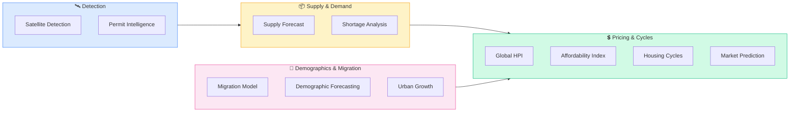

# Pod: Market Intelligence
**16 modules** — supply/demand fundamentals, macro trends, price indices, demographics, cycles



---

## Module Index
| Module | Trigger Phrases |
|--------|----------------|
| [Satellite Development Detection](#satellite-development-detection) | new construction, active builds, land use change, growth before permits |
| [Construction Permit Intelligence](#construction-permit-intelligence) | permit pipeline, permits filed, supply pipeline, units coming to market |
| [Housing Supply Forecast](#housing-supply-forecast) | how much inventory coming, 12-month supply, pipeline deliveries |
| [Housing Shortage Analysis](#housing-shortage-analysis) | housing deficit, undersupply, vacancy rate, inventory gap |
| [Global Housing Price Index](#global-housing-price-index) | price trends, HPI, price appreciation, global price comparison |
| [Macro Real Estate Dashboard](#macro-real-estate-dashboard) | macro overview, interest rates + housing, full market picture |
| [National Market Analytics](#national-market-analytics) | national trends, MSA comparison, metro ranking |
| [Global Market Dashboard](#global-market-dashboard) | global real estate, cross-country comparison, international markets |
| [Housing Cycle Predictor](#housing-cycle-predictor) | where are we in the cycle, peak, trough, correction coming |
| [Housing Affordability Index](#housing-affordability-index) | affordability, price-to-income, can buyers afford this market |
| [Demographic Forecasting](#demographic-forecasting) | population growth, age cohorts, household formation, Millennial demand |
| [Urban Growth Prediction](#urban-growth-prediction) | where is the city expanding, sprawl vs infill, growth boundary |
| [Migration Housing Model](#migration-housing-model) | who is moving here, in-migration, out-migration, relocation flows |
| [Megacity Models](#megacity-models) | tier-1 global cities, gateway markets, world city real estate |
| [Market Prediction](#market-prediction) | price forecast, where is this market going, 1-3 year outlook |
| [Forecasting](#forecasting) | custom forecast, scenario modeling, bull/base/bear |

---

## Satellite Development Detection

**Purpose**: Detect housing construction and land use change via satellite-derived signals —
bypasses the 6–18 month lag in permit data and MLS records.

**Signal Sources**:
- Planet Labs, Maxar, Google Earth Engine, Esri World Imagery — before/after imagery
- NLCD (National Land Cover Database) — agricultural/commercial → residential transitions
- Crane density, material staging, utility trenching patterns
- Cross-reference permit filings with imagery timestamps

**Activity Tiers**: High (3+ active sites/sq mi) / Medium (1–3 sites) / Low (sporadic) / Dormant

**Output Format**:
```
Activity Level: [High/Medium/Low/Dormant]
Estimated New Units: [X–Y] (confidence: H/M/L)
Primary Types: [SFR/MF/Mixed/ADU]
Time Horizon: [first detected / ongoing since / projected completion]
Key Sites: [site | stage | est. units | type | flags]
Data Caveats: [cloud cover, resolution limits, permit cross-ref status]
Next Steps: pull permits for flagged parcels | 90-day imagery update | developer ownership check
```

---

## Construction Permit Intelligence

**Purpose**: Permit filings lead MLS inventory additions by 6–24 months. Use to identify
supply changes and neighborhood growth zones before they hit the market.

**Key Data Sources**: Census BPS (census.gov/construction/bps), Accela, state aggregators
(TX TDLR, CA HCD), CoStar, BuildZoom, PermitData.com, Dodge Construction Network

**Permit Categories**: SFR | Multifamily 2–4 | Multifamily 5+ | ADU | Mixed-use

**Analysis Steps**:
1. Volume trend (YoY/MoM): acceleration / plateau / decline
2. Project type mix shift (SFR → MF = developer thesis change)
3. Geographic clustering → emerging growth zones pre-MLS
4. Developer concentration (70%+ = single-developer risk)
5. Approval rate (<70% = regulatory friction constraining supply)
6. Completion lag: SFR 7–12mo | Small MF 12–18mo | Large MF 18–36mo

**Output Format**:
```
Filing Trend: [Accelerating/Stable/Declining/Volatile]
Total Pipeline: [X units] (confidence: H/M/L)
Breakdown: [type | units | % | trend]
Top Growth Zones: [zone | count | mix]
Expected Deliveries: 12mo ~X | 24mo ~X
Risk Flags: developer concentration | approval rate | financing headwinds
```

---

## Housing Supply Forecast

**Purpose**: Forward-looking supply estimate for 12–36 months. Used for investment underwriting,
client advisory, development feasibility, policy research.

**Supply Drivers**:
1. Permit pipeline (Module above) — primary input, apply lag by product type
2. Developer activity — NAHB HMI (monthly), public builder earnings (DR Horton, Lennar, Pulte, NVR, Toll)
3. Zoning/entitlement — by-right capacity, upzoning activity, SB9/SB10 (CA), Minneapolis 2040 reforms
4. Land availability — infill sites, greenfield, land cost trajectory
5. Absorption rate — units sold/leased per month vs. projected deliveries

**Scenario Table** (always produce all three):
| Scenario | Assumption |
|----------|-----------|
| Bear | Permitting slowdown, financing headwinds, high cancellations |
| Base | Pipeline converts at historical average, no macro shocks |
| Bull | Zoning reform, capital available, developer activity sustained |

**Output Format**:
```
Pipeline Baseline: [X units permitted/under construction]
Projections: [horizon | bear | base | bull]
Absorption: [X units/mo] → [X months of supply] → [undersupplied/balanced/oversupplied]
Risk Flags: financing | zoning uncertainty | labor/materials | developer pullback
```

---

## Housing Shortage Analysis

**Purpose**: Quantify the structural housing deficit in a market — the gap between household
formation demand and available supply over time.

**Key Metrics**:
- Vacancy rate trend (healthy: 5–7% rental, 1–2% ownership)
- Household formation rate vs. new unit production (Census ACS, JCHS data)
- Doubling-up rate as hidden demand signal
- Affordability-adjusted shortfall (units affordable at median income)
- Historical underbuilding accumulation (10-yr look-back)

**Shortage Classification**:
| Level | Indicators |
|-------|-----------|
| Severe | Vacancy <3%, formation >> production for 5+ yrs, affordability crisis |
| Moderate | Vacancy 3–5%, production lagging formation by 20–40% |
| Mild | Vacancy 5–7%, supply/demand near balance, isolated submarkets tight |
| None / Oversupply | Vacancy 7%+, production exceeding household formation |

**Sources**: Census ACS, Harvard JCHS State of Nation's Housing, NAR housing deficit reports, Zillow Research

---

## Global Housing Price Index

**Purpose**: Track and compare housing price appreciation trends across markets, globally or
by metro, as a foundational input to investment thesis and market timing.

**Index Sources**:
- US: FHFA HPI (purchase-only, all-transactions), Case-Shiller 20-city, Zillow ZHVI
- International: Knight Frank Global House Price Index (quarterly), OECD Housing Prices
- Commercial: CoStar, MSCI Real Assets (formerly IPD)
- Rental: Zillow Observed Rent Index (ZORI), CoStar Multifamily Rent Index

**Key Analysis Dimensions**:
- Nominal vs. real (inflation-adjusted) appreciation
- Price-to-income ratio trajectory (affordability pressure)
- Price-to-rent ratio (buy vs. rent signal)
- YoY, 3-yr, 5-yr, 10-yr compound appreciation
- Divergence: metro vs. submarket vs. national trend

---

## Macro Real Estate Dashboard

**Purpose**: Synthesize macro conditions — interest rates, credit availability, employment,
GDP, consumer confidence — into a unified signal for real estate market direction.

**Macro Inputs to Track**:
- 30-yr fixed mortgage rate (Freddie Mac PMMS, weekly)
- Fed Funds Rate trajectory (FOMC dot plot)
- 10-yr Treasury yield (mortgage rate leading indicator)
- Unemployment rate (BLS monthly) — demand anchor
- Consumer confidence (Conference Board, University of Michigan)
- Credit availability: Mortgage Credit Availability Index (MBA MCAI)
- Housing starts + building permits (Census, monthly)
- Existing home sales + pending sales (NAR monthly)
- New home sales (Census/HUD monthly)

**Cycle Signal**:
- Expansion: Low rates + high employment + rising sales + tight inventory
- Peak: Affordability stress + declining volume + price deceleration
- Contraction: Rising rates + job losses + inventory building + price cuts
- Trough: Capitulation pricing + investor activity + early volume uptick

---

## National Market Analytics

**Purpose**: Rank and compare MSAs on key investment and market health metrics. Used for
capital allocation decisions, market entry/exit, and client relocation advisory.

**Ranking Dimensions** (score 1–10 each):
1. Price appreciation momentum (3-yr CAGR)
2. Population and household formation growth
3. Job market depth and diversification
4. Supply/demand balance (months of inventory)
5. Affordability relative to income growth
6. Infrastructure investment momentum
7. Net migration (domestic + international)
8. Cap rate environment (yield availability)

**Sources**: Zillow Metro Market Reports, Redfin Metro Data, NAR metro stats, BLS QCEW, Census B25001

---

## Housing Cycle Predictor

**Purpose**: Identify where a market sits in the real estate cycle and forecast the likely
next phase. Combines leading, coincident, and lagging indicators.

**Cycle Phases**:
| Phase | Key Signals |
|-------|------------|
| Recovery | Low vacancy, rising occupancy, minimal new supply, flat rents |
| Expansion | Rising rents, new construction starts, positive absorption, investor activity |
| Hypersupply | Supply exceeds demand growth, rising vacancy, rent deceleration |
| Recession | Negative absorption, price declines, distress, high vacancy |

**Leading Indicators**: Permit filings, NAHB HMI, mortgage applications (MBA weekly)
**Coincident Indicators**: Sales volume, days on market, list-to-sale ratio, price cuts %
**Lagging Indicators**: Median price, foreclosure rates, delinquency rates

---

## Housing Affordability Index

**Purpose**: Measure whether typical buyers can afford homes in a target market,
and forecast demand sustainability under various rate/income scenarios.

**Key Ratios**:
- Price-to-income: Median price ÷ Median HH income (healthy: <4x; stressed: 6–9x; extreme: 9x+)
- Monthly PITI as % of median income (healthy: <30%; stressed: 35–45%; extreme: 45%+)
- NAR Housing Affordability Index (100 = qualifying income exactly meets median price)
- Rent-to-income ratio: Median rent ÷ Median HH income (healthy: <30%)

**Scenario Modeling**: Run at current rate, +1%, +2%, -1% to show demand sensitivity
**Sources**: NAR HAI, Harvard JCHS, Zillow, Redfin, BLS CPI-Housing, FRED

---

## Demographic Forecasting

**Purpose**: Project household formation, age-cohort demand shifts, and population flows
to forecast medium-term housing demand fundamentals.

**Key Cohort Drivers**:
- Millennials (born 1981–1996): Peak homebuying age — largest cohort in US history
- Gen Z (born 1997–2012): Entering rental market now, first-time buying wave begins ~2025–2032
- Baby Boomers: Downsizing wave, unlock existing inventory, demand senior housing
- Immigration flows: Gateway city and secondary city impacts

**Data Sources**:
- Census Population Projections (2020 base, 2050 horizon)
- Census ACS 1-yr and 5-yr estimates (B25003, B11001 tables)
- IRS SOI migration data (county-to-county flows)
- NAR Generational Trends Report (annual)

---

## Urban Growth Prediction

**Purpose**: Forecast where within a metro area growth is most likely to concentrate —
infill vs. greenfield, urban core vs. suburban edge, TOD corridors.

**Growth Pattern Analysis**:
- Infill capacity: Underutilized parcels, surface lots, commercial conversion opportunity
- Urban growth boundary positions and proposed expansions
- TOD (Transit-Oriented Development) corridor mapping
- Employment center shift — where are jobs moving?
- School district capacity as suburban growth signal

**Sources**: Local planning department GIS, MPO land use plans, EPA Smart Location Database,
LEHD Origin-Destination Employment Statistics (LODES)

---

## Migration Housing Model

**Purpose**: Quantify population movement into and out of a market and translate flows
into housing demand projections.

**Migration Data Sources**:
- IRS SOI county-to-county migration (annual, ~18mo lag)
- Census ACS 1-yr estimates (migration question)
- Redfin cross-market search data (where are people searching from?)
- U-Haul/Penske growth market reports (origin/destination)
- LinkedIn migration data (employment-driven moves)

**Migration → Demand Translation**:
- Each net new household = ~1.0 housing unit of demand
- Adjust for multi-person households vs. solo movers
- Layer in income of in-migrants relative to local pricing

**High-Conviction Signal**: Sustained net in-migration of 1%+ of population/year,
from multiple origin markets, confirmed across 2+ data sources

---

## Megacity Models

**Purpose**: Analyze global tier-1 city real estate markets — gateway markets where
international capital concentrates and local fundamentals diverge from national trends.

**Tier-1 Megacity Set**: New York, Los Angeles, London, Tokyo, Singapore, Hong Kong,
Sydney, Toronto, Paris, Dubai, Shanghai, Mumbai (context-dependent)

**Key Megacity Metrics**:
- Global Capital Attractiveness Score (JLL City Momentum Index)
- Price-to-income ratio (often 15–30x in tier-1 cities)
- Foreign ownership share and capital flow direction
- Luxury vs. mid-market vs. affordable divergence
- Government supply intervention risk (cooling measures, foreign buyer taxes)

**Sources**: Knight Frank Wealth Report, JLL City Momentum Index, CBRE Global Living,
ULI Emerging Trends in Real Estate (annual)

---

## Market Prediction

**Purpose**: Produce a structured 1–3 year price and volume forecast for a target market,
combining supply/demand fundamentals with macro tailwinds and headwinds.

**Forecast Components**:
1. Supply pipeline (from Permit Intelligence + Supply Forecast)
2. Demand trajectory (from Demographic + Migration modules)
3. Macro overlay (interest rate scenarios, employment forecast)
4. Historical cycle positioning (from Housing Cycle Predictor)
5. Capital flow momentum (institutional, foreign, iBuyer)

Always produce Bear / Base / Bull with explicit assumptions for each.

---

## Forecasting (Custom Scenario Modeling)

**Purpose**: Build custom forecast models when standard modules don't fit the user's
specific question — novel geographies, combined variables, or investor-specific scenarios.

**Modeling Approach**:
1. Define the target variable (price, volume, rent, vacancy, absorption)
2. Identify the 3–5 most influential drivers for that variable in this market
3. Set Bear / Base / Bull assumptions for each driver
4. Build scenario table and sensitivity analysis
5. State confidence level and primary uncertainty factor

**When to Use**: Atypical markets, custom investor underwriting, policy impact analysis,
development pro forma stress-testing
