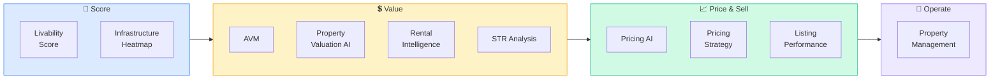

# Pod: Property Intelligence
**10 modules** — valuation, pricing, neighborhood scoring, infrastructure, rental, listing performance



---

## Module Index
| Module | Trigger Phrases |
|--------|----------------|
| [Neighborhood Livability Score](#neighborhood-livability-score) | is this neighborhood good, quality of life score, compare neighborhoods |
| [Infrastructure Growth Heatmap](#infrastructure-growth-heatmap) | where is growth heading, infrastructure investments, transit-driven growth |
| [Automated Valuation Model](#automated-valuation-model) | what is this property worth, AVM, estimate value, quick valuation |
| [Property Valuation AI](#property-valuation-ai) | full valuation, appraisal support, detailed value estimate |
| [Pricing AI](#pricing-ai) | what should I price this at, optimal listing price, pricing model |
| [Pricing Strategy](#pricing-strategy) | pricing strategy, how to price for multiple offers, price reduction timing |
| [Listing Performance AI](#listing-performance-ai) | why isn't my listing selling, listing analysis, DOM analysis, photo score |
| [Rental Intelligence](#rental-intelligence) | rental market, what can I rent this for, rental comps, rent trend |
| [Short-Term Rental](#short-term-rental) | Airbnb, VRBO, STR, short term rental analysis, nightly rate |
| [Property Management](#property-management) | managing property, tenant relations, maintenance, operating costs |

---

## Neighborhood Livability Score

**Purpose**: Objective, Fair Housing-compliant quality-of-place score. Used for buyer/renter
advisory, investment comparison, and identifying neighborhoods where improving livability
precedes value appreciation.

**Scoring Dimensions** (each 0–25, total 0–100):

**Dimension 1: Transit Access (0–25)**
- Walk Score / Transit Score (walkscore.com)
- Distance and frequency to nearest transit stop
- Bike infrastructure: protected lanes, bike share
- Points: 20+ min walk = 0–5 | 10–20 min = 6–12 | 5–10 min = 13–18 | <5 min = 19–25

**Dimension 2: Parks & Amenities (0–25)**
- Park acreage per 1,000 residents (Trust for Public Land ParkScore)
- Grocery, healthcare, library, recreation center within 1-mile
- Restaurant / retail diversity of options

**Dimension 3: Safety Indicators (0–25)**
- Property crime rate vs. city/county average (FBI UCR / local PD open data)
- Violent crime rate vs. average
- Trend: improving / stable / worsening
- Always use rates, not raw counts — normalize for density

**Dimension 4: Education Access (0–25)**
- Schools within 1.5-mile radius (all types)
- School proximity and walkability
- Early childhood education availability
- Community college / university proximity

**Trend Signal**: Score change over 3 years:
- +5 pts or more = Improving → potential pre-appreciation signal
- ±4 pts = Stable
- -5 pts or more = Declining → risk flag

**Fair Housing**: Score ONLY on infrastructure and amenity metrics. Never reference
demographic composition, school "desirability" framed demographically, or any proxy
for protected class characteristics.

**Output Format**:
```
Overall Score: [X]/100 — [Excellent 85+ / Good 70–84 / Fair 55–69 / Below Avg <55]
Sub-scores: [Transit | Parks | Safety | Education] each out of 25
Trend: [Improving/Stable/Declining] — [X-pt change over Y years]
Strengths: [top 2–3 dimensions]
Gaps: [bottom 1–2 dimensions]
Comparable neighborhoods: [name | score | key differentiator]
```

---

## Infrastructure Growth Heatmap

**Purpose**: Identify where a metro is concentrating infrastructure investment — a leading
indicator of property value appreciation 2–7 years ahead.

**Infrastructure Categories**:

**Transit** (highest ROI for residential proximity):
- New light rail, BRT, subway extensions — value lift radius 0.25–0.5 mile
- Highway interchanges — vehicle-access growth zones
- Sources: MPO Transportation Improvement Programs (TIPs), FTA CIG tracker

**Educational**:
- New K–12 construction, university expansion
- Sources: State DOE capital programs, school bond measures

**Healthcare**:
- Hospital construction, medical campus expansion
- Life sciences / biotech facilities (employment anchor)
- Sources: CON filings, hospital system annual reports

**Commercial Anchors**:
- Major employer campus, distribution center, logistics hub
- Retail anchors (grocery = population density signal)
- Sources: Local planning dept., CoStar, Bisnow, economic development agency

**Heat Zone Tiers**:
| Tier | Criteria |
|------|---------|
| Top Growth | 3+ major projects within 1 mile, multi-mode, 2–5yr delivery |
| Emerging | 1–2 confirmed projects, additional in pipeline, 3–7yr horizon |
| Stable | Existing infrastructure maintained, no major new investment |
| Declining | Infrastructure deferred, anchor closures, disinvestment signals |

**Value Appreciation Timeline**:
| Type | Lead Time | Expected Lift |
|------|-----------|--------------|
| Transit (rail/BRT) | 3–7 yrs | 10–25% within 0.25 mile |
| Highway interchange | 2–5 yrs | 5–15% in growth zones |
| Major employer | 1–3 yrs (announcement) | 5–20% within 2-mile shed |
| School construction | 2–4 yrs | Moderate, neighborhood-level |
| Hospital / medical | 3–6 yrs | Strong for adjacent mixed-use |

---

## Automated Valuation Model

**Purpose**: Rapid property value estimate using algorithmic comparison of sales data,
property attributes, and market conditions. Use for quick screening and portfolio pricing.

**AVM Methodology**:
1. Pull comparable sales: 0.25–0.5 mile radius, ±20% size, same property type, last 90–180 days
2. Apply adjustment grid: $/SF baseline + adjustments for beds/baths, garage, lot, condition, age
3. Weight recency: More recent comps weighted higher (half-life model)
4. Market trend adjustment: Apply appreciation/depreciation rate to all comps
5. Confidence score: Based on comparable density and consistency

**AVM Confidence Tiers**:
- High: 5+ recent sales within 0.25 mile, tight price/SF range (<15% variance)
- Medium: 3–5 sales, 0.25–0.5 mile, moderate variance (15–25%)
- Low: <3 comps, >0.5 mile, high variance (25%+) or unique property

**Commercial AVM** (income approach overlay):
- Income capitalization: Value = NOI ÷ Market Cap Rate
- Cross-check: Sales comparison vs. income approach — flag if >15% divergence

**Best-in-Class AVM Tools**: Zillow Zestimate (public), Redfin Estimate (public),
CoreLogic AVM, Attom AVM, First American FNC

---

## Property Valuation AI

**Purpose**: Produce a comprehensive, defensible property value estimate — beyond AVM —
incorporating market context, property condition, and professional judgment framework.

**Full Valuation Approach** (supports appraisal review):

**Sales Comparison Approach**:
- 3–6 closed comparable sales
- Adjustment grid with documented basis for each adjustment
- Reconcile to value range, select point estimate with narrative justification

**Income Approach** (income-producing properties):
- Reconstruct NOI from rent roll, expenses, vacancy
- Select market cap rate with peer transaction support
- Discounted Cash Flow (DCF) for value-add or development scenarios

**Cost Approach** (unique or special-use properties):
- Land value estimate (comparable land sales)
- Replacement cost new (RCN) using Marshall & Swift or local cost data
- Depreciation: Physical, functional, external

**Reconciliation**: Weight the three approaches based on property type and data quality.
Residential: primary weight on sales comparison. Commercial: equal weight sales + income.
Special use: primary weight on cost.

---

## Pricing AI

**Purpose**: Determine the optimal listing price for a property to maximize net proceeds
within a target time frame, using predictive market modeling.

**Pricing Inputs**:
- AVM range (floor and ceiling)
- Comparable active listings (competing supply)
- Absorption rate at different price bands
- Days-on-market distribution at price/SF deciles
- Seller timeline (30 days vs. 90 days changes optimal price by 3–8%)
- Current market momentum (bidding war frequency, list-to-sale ratio)

**Price Band Strategy**:
- Premium pricing (top 10% of comp range): Appropriate in <2-month supply market
- Market pricing (25th–75th percentile of comps): Broadest buyer pool, predictable DOM
- Aggressive pricing (below comps): Use to generate multiple offers in balanced markets
- Price reduction triggers: 10–14 days without offers → reassess at 5–7% below current

**Automated Price Signal**:
Days on market before price reduction typically indicates where you are vs. market:
- 0–7 days, no offers: Significantly overpriced (>5% above market)
- 7–14 days, some showings: Slightly overpriced (2–5%)
- 14–21 days: At market, demand may just be slower
- 21+ days: Demand problem or condition/marketing issue beyond price

---

## Pricing Strategy

**Purpose**: Develop the strategic approach to pricing — not just the number, but the
method and tactics to achieve the seller's goals.

**Strategy Options**:

**Auction/Offer Deadline Strategy** (seller's market):
- Price 2–5% below market value
- Set offer deadline (7–10 days)
- Generate multiple offers
- Creates transparent competitive environment
- Risk: May not generate competition in balanced/buyer's market

**Value-Range Pricing** (some MLS markets allow):
- List at range (e.g., $750K–$825K)
- Signals negotiability while anchoring high
- Attracts wider buyer pool than single high price

**Just-Below-Round-Number Pricing**:
- $499,000 instead of $500,000
- Captures buyers searching up to $500K threshold
- Especially relevant for portal search filter behavior

**Staged Reduction Strategy** (slow market):
- Start at market-supportable price
- Pre-plan reduction schedule: Day 14 → -3% | Day 28 → -5% | Day 42 → reposition
- Communicate strategy to seller upfront to avoid friction

---

## Listing Performance AI

**Purpose**: Diagnose why a listing is underperforming and prescribe specific improvements
to photography, description, pricing, showing mechanics, or marketing distribution.

**Performance Metrics to Analyze**:
- Days on market vs. market median
- Online views and saves (Zillow/Redfin traffic data)
- Showing request rate (ShowingTime data)
- Showing-to-offer conversion rate
- Price reduction history
- Feedback patterns from showing agents

**Diagnosis Framework**:
| Symptom | Likely Cause |
|---------|-------------|
| High views, low showings | Price or photos not matching; unappealing first photo |
| Good showings, no offers | Condition issues; price 3–8% high; competing inventory |
| Low views, low showings | Marketing distribution failure; SEO/headline issue; wrong platform |
| Offers but falling through | Inspection issues; appraisal gap; buyer financing |

**Photography Scoring**:
- Hero shot: Exterior in good light, straight angle, no cars blocking
- Interior: Wide angle, natural light + staging, no clutter
- Minimum photos: 25 for SFR, 15 for condo
- Virtual tour: 40%+ showings are now pre-screened via virtual tour

---

## Rental Intelligence

**Purpose**: Analyze rental market conditions — current rents, rent growth trajectory,
vacancy rates, absorption — for investor underwriting and landlord pricing.

**Rental Market Metrics**:
- Asking rent vs. effective rent (net of concessions)
- Rent growth: YoY %, trailing 3-month velocity
- Vacancy rate: submarket, product type, vintage
- Absorption: Net units leased per month
- Concessions trend: Free months, move-in specials (signal of softening)

**Rent Comparables Method**:
1. Define comp set: same submarket, ±20% unit size, similar amenity tier
2. Adjust for floor, view, parking, storage, W/D in unit, pet policy
3. Age/vintage adjustment: newer properties command 10–20% premium
4. Time-adjust: Apply monthly rent change rate to aged comps

**Rental Data Sources**:
- Zillow Observed Rent Index (ZORI) — asking rents, free, metro-level
- CoStar Multifamily Analytics — professional grade, paid
- Yardi Matrix — institutional multifamily, paid
- ApartmentList, Rent.com — asking rent aggregators (free, less rigorous)
- RealPage Market Analytics — institutional, paid

---

## Short-Term Rental

**Purpose**: Analyze STR revenue potential, regulatory environment, and operational
requirements for Airbnb/VRBO-style rental strategy.

**STR Revenue Modeling**:
- Gross Revenue = ADR (Average Daily Rate) × Occupancy Rate × 365
- ADR benchmark: 1.5–2.5x comparable LTR monthly rent ÷ 30 (rough rule of thumb)
- Occupancy varies widely: tourist markets 65–80%; urban weekday 45–60%
- Net Revenue after platform fees (3% host fee Airbnb) and cleaning costs
- Operating margin: Typically 50–65% of gross revenue before mortgage

**STR Data Sources**:
- AirDNA: Occupancy, ADR, RevPAR by market and property type (paid)
- Rabbu: STR data with investment analysis (paid)
- AllTheRooms: Aggregated STR data (paid)
- Mashvisor: Investment analysis + STR projections (paid)

**Regulatory Risk Assessment**:
STR regulations vary dramatically by city. Check:
- Is the unit the host's primary residence? (Many cities require this)
- License/permit requirement and associated fees
- Night caps (e.g., NYC 30-night minimum effectively bans most STR)
- HOA restrictions (often prohibit STR entirely)
- Zoning overlay: Is STR permitted in this zone?

**High-Regulation Markets** (as of 2024): New York City (near-ban), Santa Monica,
San Francisco, Amsterdam, Barcelona, Paris — verify current status before underwriting.

---

## Property Management

**Purpose**: Operational framework for managing residential or commercial properties —
tenant relations, maintenance systems, operating cost benchmarks, and financial management.

**Operating Cost Benchmarks** (residential):
| Expense | Benchmark |
|---------|----------|
| Property management fee | 8–12% of collected rent |
| Maintenance/repairs | 1–1.5% of property value/yr |
| Capital expenditure reserve | 1–2% of property value/yr |
| Vacancy allowance | 5–10% of gross rent |
| Insurance | 0.5–1.0% of property value/yr |
| Property taxes | Varies; 1–3% of assessed value |

**Total OPEX Rule of Thumb**: 40–55% of Gross Potential Income for single-family/small MF

**Maintenance Priority System**:
- P1 (Emergency, <4 hours): HVAC failure in extreme temps, water intrusion, security
- P2 (Urgent, <24 hours): Appliance failure, plumbing leak, heat/AC in mild weather
- P3 (Routine, <7 days): Non-emergency repairs, cosmetic issues
- P4 (Deferred, scheduled): Preventive maintenance, unit turns, capital projects

**Tenant Retention Economics**:
- Average turnover cost: $1,500–$4,000 (vacancy + make-ready + leasing)
- Rent premium to retain: Offering below-market renewal rate saves more than turnover cost
- Target retention: 75–85% annual retention rate for stabilized properties

**Property Management Software**: AppFolio, Buildium, Yardi Breeze, RealPage, Rentec Direct
