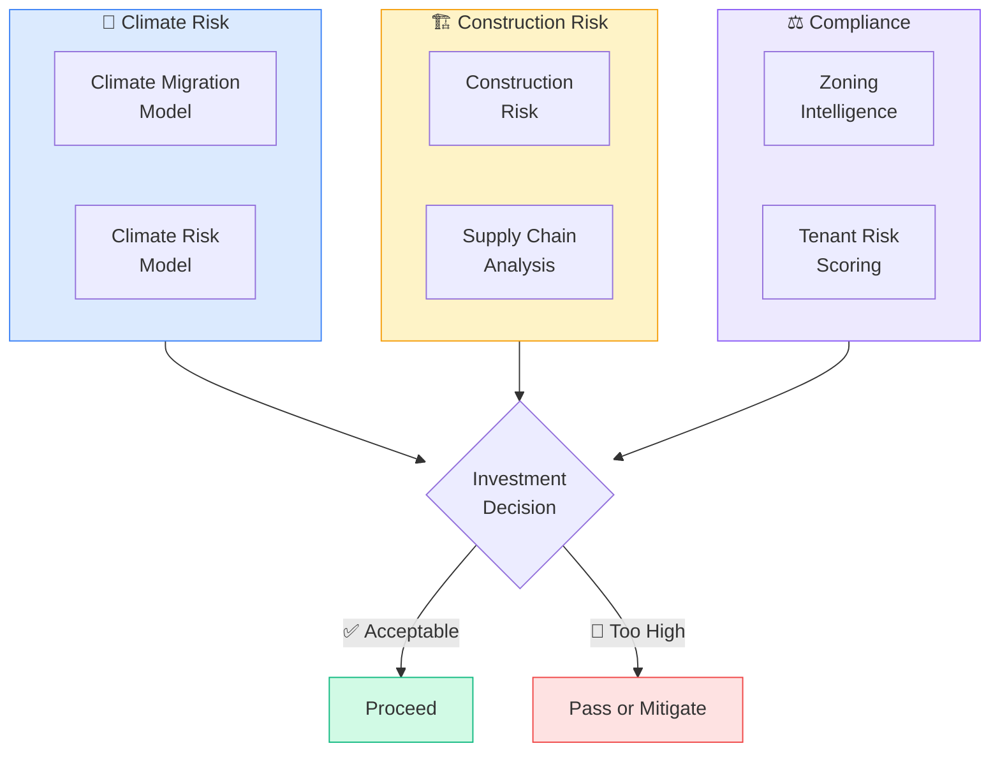

# Pod: Risk & Climate
**6 modules** — climate risk, construction risk, zoning, supply chain, tenant screening



---

## Module Index
| Module | Trigger Phrases |
|--------|----------------|
| [Climate Migration Model](#climate-migration-model) | climate refugees, where are people moving due to climate, climate demand |
| [Climate Risk Model](#climate-risk-model) | flood risk, wildfire risk, sea level rise, insurance crisis, climate exposure |
| [Construction Risk](#construction-risk) | builder risk, construction delays, cost overruns, project risk |
| [Construction Supply Chain](#construction-supply-chain) | lumber prices, material costs, subcontractor availability, supply chain delays |
| [Zoning Intelligence](#zoning-intelligence) | what can I build here, zoning code, permitted uses, rezoning |
| [Tenant Risk Scoring](#tenant-risk-scoring) | tenant screening, eviction risk, rent default probability, credit scoring |

---

## Climate Migration Model

**Purpose**: Analyze how climate risk is driving population movement and how those flows
affect housing demand — both origin markets losing residents and destination markets receiving them.

**Climate Risk Categories**:

**Sea Level Rise / Coastal Flood**:
- NOAA SLR projections: 0.3m, 0.5m, 1.0m, 1.5m, 2.0m scenarios
- FEMA FIRM flood zones: AE (100-yr), VE (coastal wave), X (minimal)
- First Street Foundation Flood Factor (1–10 scale, property-level)
- NFIP vs. private market availability and premium trajectory

**Extreme Heat**:
- NOAA heat index projections: Days >95°F, >105°F per decade
- Urban heat island amplification
- Phoenix, Las Vegas, Houston outmigration signal from extreme heat

**Wildfire**:
- First Street Foundation Fire Factor (property-level)
- CAL FIRE / USFS WUI (Wildland-Urban Interface) maps
- Insurance carrier withdrawal: State Farm CA pullback as leading indicator
- Home hardening cost as risk-severity proxy

**Hurricane / Wind**:
- NOAA hurricane return period maps
- IBHS FORTIFIED standards adoption rate
- Windstorm insurance availability and cost trajectory

**Climate Resilience Positives**:
- Water security: drought risk, sustainable water sources
- Grid stability: renewable penetration, grid hardening investment
- City-level adaptation planning

**Migration Patterns**:
- Florida → Carolinas, Tennessee, inland Texas
- California coastal → Inland Empire, Phoenix, Colorado
- Gulf Coast → Austin, Denver, Nashville

**Output Format**:
```
Climate Risk Profile: [flood | heat | wildfire | wind] → [H/M/L | trajectory | insurance signal]
Overall Resilience: Strong / Moderate / At Risk / High Risk
Migration Role: Origin (outmigration) / Destination (inflow) / Neutral
Net Migration Trend: [+/- X,000/yr — source + vintage]
Housing Demand: 5-yr [up/flat/down] | 10-yr [speculative with wildcards]
Scenarios: Bear [accelerates] | Base [continues] | Bull [adaptation succeeds]
Next Steps: First Street scores | insurance quotes | carrier write-list check
```

---

## Climate Risk Model

**Purpose**: Quantify physical climate risk for a specific property, portfolio, or submarket
to support underwriting, insurance planning, and long-term hold decisions.

**Risk Scoring Framework**:

| Risk Type | Data Source | Score Scale |
|-----------|------------|-------------|
| Flood | First Street Flood Factor, FEMA FIRM | 1–10 |
| Fire | First Street Fire Factor, CAL FIRE WUI | 1–10 |
| Heat | First Street Heat Factor, NOAA projections | 1–10 |
| Wind/Storm | First Street Wind Factor, NOAA return periods | 1–10 |
| Drought/Water | USDA drought monitor, GRACE groundwater data | 1–10 |

**Insurance Market Signal**:
- Carrier availability: How many carriers writing in this zip code?
- Premium trajectory: 3-yr trend in homeowners/commercial property insurance
- Premium-to-NOI ratio: >5% is a distress signal for investment properties
- NFIP vs. private market split: NFIP dependency = subsidized risk, reform exposure

**Climate Risk → Property Value Impact**:
- Properties in FEMA AE zones trade at 5–15% discount vs. comparable X-zone properties
- High Fire Factor (8–10): Insurance availability collapse → forced sales → 10–30% value drag
- Repeat flooding events: Each event depresses value 3–8% on average (First Street research)

---

## Construction Risk

**Purpose**: Identify and quantify risks in active construction projects — cost overruns,
schedule delays, contractor failure, material unavailability.

**Risk Categories**:

**Cost Risk**:
- Material price volatility (lumber, steel, concrete, copper)
- Labor cost escalation (construction labor shortage in most US metros)
- Design change orders (typically add 5–15% to original budget)
- Contingency adequacy: Standard 10% soft contingency; 5–10% hard contingency

**Schedule Risk**:
- Permit and inspection delays (3–18 months in high-friction markets)
- Weather delays (quantify by geography and season)
- Supply chain lead times: MEP equipment 16–52 weeks; steel 8–16 weeks
- Subcontractor availability (especially electrical, HVAC)

**Contractor Risk**:
- Financial stability of GC (request bonding capacity, latest financial statements)
- Subcontractor concentration (if 1–2 subs do 60%+ of work = concentration risk)
- Performance bond adequacy (100% of contract value recommended)

**Risk Mitigation**:
- GMP (Guaranteed Maximum Price) contract with change order controls
- Performance and payment bonds (100% contract value)
- Owner's project manager or construction monitor
- Monthly lender inspection + draw control

---

## Construction Supply Chain

**Purpose**: Analyze construction material availability, lead times, and cost trajectories
to inform project timing, budgeting, and procurement strategy.

**Key Material Categories & Risk Signals**:

| Material | Price Index | Lead Time Signal | Key Risk |
|----------|------------|-----------------|---------|
| Lumber (Random Length) | CME Lumber Futures, Random Lengths | 2–6 weeks | Volatile — can double in 12 months |
| Steel (Hot-rolled coil) | CRU Steel Price Index | 8–16 weeks | Tariff/trade policy sensitive |
| Copper | LME Copper, COMEX | 4–8 weeks | EV/grid demand competing with construction |
| Concrete / Cement | PCA Cement Report | 2–4 weeks | Regional, driven by local aggregate |
| MEP Equipment | Manufacturer lead time reports | 16–52 weeks | HVAC, switchgear, transformers |
| Windows/Curtainwall | Glazing contractor survey | 12–26 weeks | Post-pandemic supply still constrained |

**Sources**: Associated Builders and Contractors (ABC) Supply Chain Index, AGC
Construction Cost Reports (monthly), Turner Building Cost Index, Rider Levett Bucknall

**Procurement Strategy**:
- Long-lead items: Identify at design development, procure 6–12 months early
- Material escalation clauses: Build into GMP contract for >6-month exposure
- Domestic vs. imported sourcing: Consider tariff risk on imported materials

---

## Zoning Intelligence

**Purpose**: Analyze zoning regulations, permitted uses, density allowances, and entitlement
pathways for a target property or submarket.

**Zoning Analysis Components**:

**Base Zoning Classification**:
- Residential: R1 (SFR), R2 (duplex), R3 (MF low-rise), R4 (MF mid-rise), R5 (high-rise)
- Commercial: C1 (neighborhood retail), C2 (community commercial), C3 (general commercial)
- Mixed-Use: MU zones allowing residential above commercial
- Industrial: M1 (light), M2 (medium), M3 (heavy)
- Agricultural: A1, A2 (relevant for land acquisition)

**Key Development Standards**:
- FAR (Floor Area Ratio): Total floor area ÷ Lot area
- Lot coverage: Footprint as % of lot
- Height limit: Stories or feet
- Setbacks: Front, rear, side (in feet)
- Parking requirements: Spaces per unit or per 1,000 SF
- Density: Max units per acre

**Entitlement Pathway**:
| Type | Approval Body | Timeline | Risk Level |
|------|--------------|----------|-----------|
| By-right | Building dept. only | 1–6 months | Low |
| Administrative | Planning staff | 3–9 months | Low-Medium |
| CUP / Variance | Planning commission | 6–18 months | Medium |
| Rezoning | City council / board | 12–36 months | High |

**Zoning Reform Landscape** (as of 2024):
- ADU reforms: Most states now mandate ADU allowances in R zones
- Duplex by right: CA, OR, MT, WA, others allow duplexes in most residential zones
- TOD upzoning: 0.5-mile radius from transit stations in many metros
- Parking minimums eliminated: Over 100 US cities have reduced or eliminated minimums

**Sources**: Local municipal code (Municode.com), Zoneomics, Regrid, SmartZone (urban3)

---

## Tenant Risk Scoring

**Purpose**: Assess the probability of tenant default, late payment, and eviction risk
to support leasing decisions, portfolio underwriting, and rental pricing.

**Scoring Dimensions**:

**Financial Capacity**:
- Income-to-rent ratio: Minimum 3x monthly rent in gross income (some markets 2.5x)
- Employment stability: W2 vs. self-employed; tenure at current employer
- Credit score benchmarks: 680+ low risk; 620–679 moderate; <620 high risk
- Debt-to-income ratio: Total monthly obligations ÷ gross monthly income (<45%)

**Rental History**:
- Prior eviction records (national eviction databases: Experian RentBureau, TransUnion SmartMove)
- Payment history with prior landlords
- Notice given at prior tenancies
- Reference quality from prior landlords

**Risk Signal Adjustments**:
- Student / co-signer situations: Require co-signer with 4x rent income
- Section 8 / voucher holders: Stable income source, additional protections apply
- Short employment tenure (<6 months): Higher weight on credit and reserves
- Recent bankruptcy: Review discharge date and post-BK credit behavior

**Fair Housing Note**: Scoring criteria must be applied uniformly to all applicants.
Income source discrimination (e.g., refusing voucher holders) is prohibited in many jurisdictions.
Never use race, national origin, familial status, or disability as screening criteria.

**Tools**: TransUnion SmartMove, Experian Connect, Avail, TurboTenant, AppFolio
